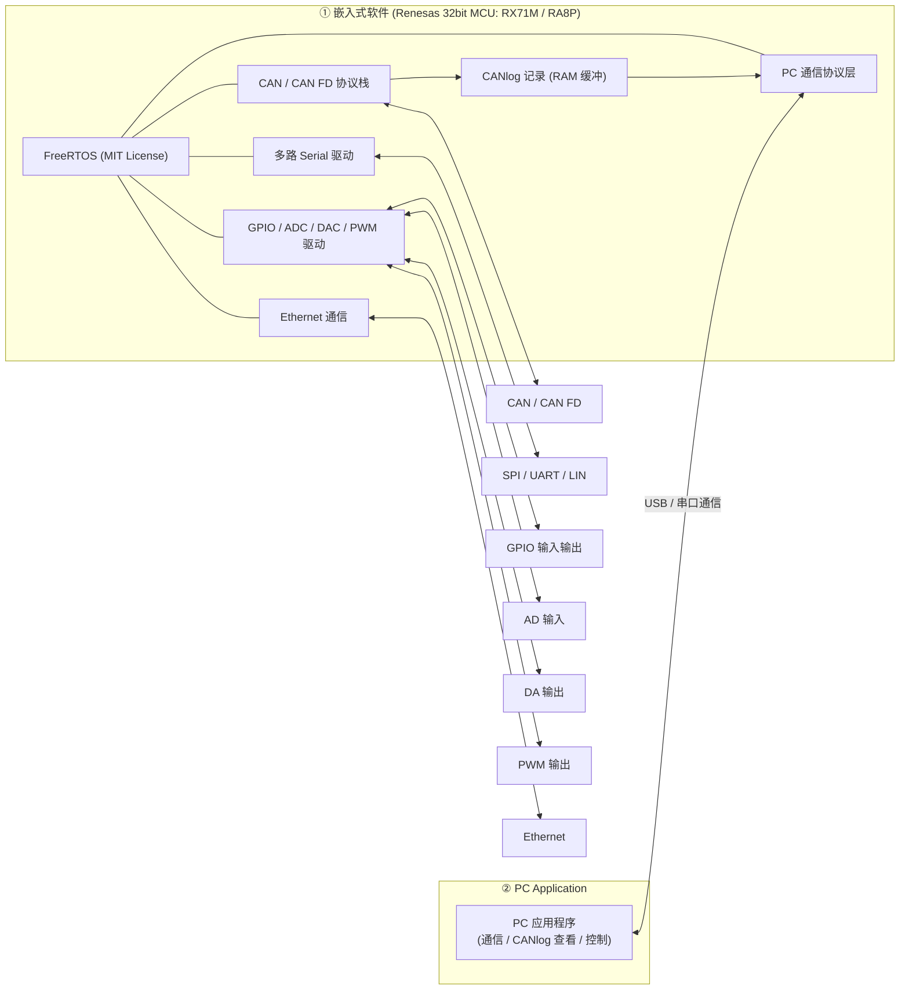
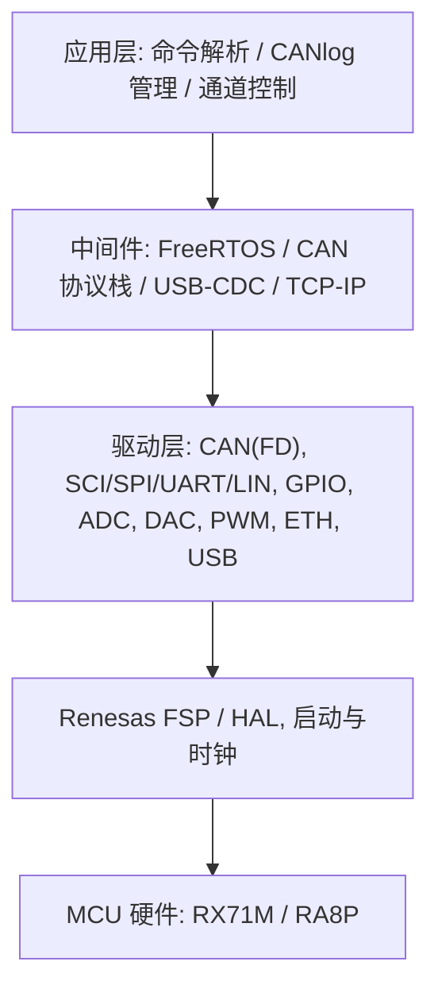

# 嵌入式软件开发委托 — 系统图与需求分析

## 1. 系统结构图

## 2. 软件分层视图（建议）

## 3. 需求概要

| 项目 | 内容 |
|---|---|
| 目标 MCU | Renesas 32bit：RX71M、RA8P |
| OS | FreeRTOS（MIT License） |
| PC 通信 | USB、串口 |
| 车载/工业总线 | CAN、CAN FD |
| 日志 | CANlog 记录（VRAM）并传至 PC |
| 多路串行 | SPI、UART、LIN |
| 模拟/数字 IO | GPIO 输入输出、AD 输入、DA 输出、PWM 输出 |
| 网络 | Ethernet |
| PC 端 | PC Application（另有范围） |
| 工作范围 | 需求分析 → 设计 → 实现 → 测试（不给详细设计指示） |
| 合同形式 | 派遣 或 準委任 |
| 开始时间 | 2026/11〜 |
| 其他 | 已有 PoC 产品，可演示说明 |

## 4. 关键风险与待确认事项

1. **RX71M 与 CAN FD**：RX71M 的 CAN 模块为经典 CAN，不支持 CAN FD；CAN FD 大概率只能由 RA8P 侧实现，需确认两款 MCU 是否都要覆盖全部功能，还是分机型。
2. **“VRAM”含义**：疑似 RAM 或专用显存/外部存储，需确认日志容量、保存时长、是否需要断电保持（Flash / SD）。
3. **性能指标未给出**：CAN 总线负载、CAN FD 速率、PC 吞吐量、采样率、PWM 频率、AD/DA 分辨率与通道数均未定义。
4. **范围边界**：PC Application 是否包含在本次委托内（图中标为 ②，疑似另一部分）。
5. **PoC 的复用**：现有 PoC 代码质量、归属、可复用程度，是否需要重写。
6. **开发环境**：IDE / 编译器（e2 studio、CC-RX、GCC）、调试器、实机与测试设备的提供方式。
7. **合同形式**：“不给详细设计指示、从需求分析起交付”适合準委任；派遣则客户需负责指挥，两者与此要求不一致，需协商。
8. **时间紧**：2026/11 起开始，距今约 1 个月，团队与资源需尽快确定。

## 5. 建议的推进方式

- 先要求 PoC 演示与需求澄清会议，收集性能指标。
- 以里程碑拆分：驱动层（CAN/Serial/IO）→ 通信与日志 → Ethernet → 集成测试。
- 报价按工数（人月）估算，并明确前提条件与假设。
