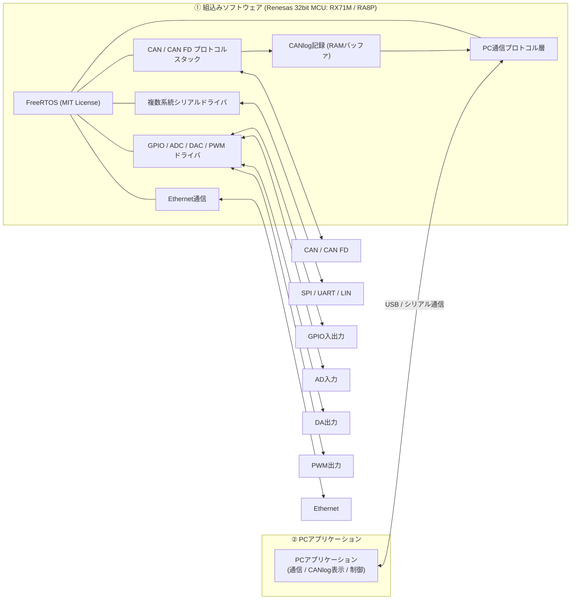
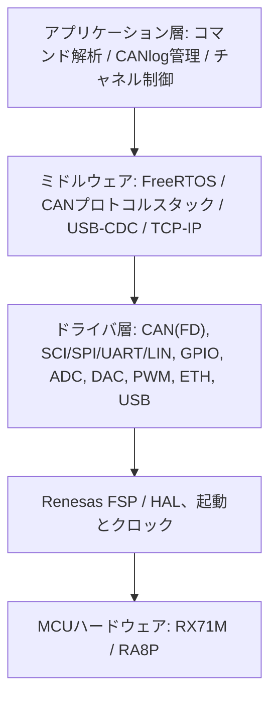

# 組込みソフトウェア開発委託 — システム構成図と要求分析

## 1. システム構成図

## 2. ソフトウェア階層ビュー（案）

## 3. 要求概要

| 項目 | 内容 |
|---|---|
| 対象 MCU | Renesas 32bit：RX71M、RA8P |
| OS | FreeRTOS（MIT License） |
| PC 通信 | USB、シリアル |
| 車載／産業バス | CAN、CAN FD |
| ログ | CANlog を記録（VRAM）し、PC へ転送 |
| 複数系統シリアル | SPI、UART、LIN |
| アナログ／デジタル IO | GPIO 入出力、AD 入力、DA 出力、PWM 出力 |
| ネットワーク | Ethernet |
| PC 側 | PC アプリケーション（別スコープ） |
| 作業範囲 | 要求分析 → 設計 → 実装 → テスト（詳細設計の指示は出さない） |
| 契約形態 | 派遣 または 準委任 |
| 開始時期 | 2026/11〜 |
| その他 | 既存の PoC 製品あり。デモによる説明が可能 |

## 4. 主要なリスクと確認事項

1. **RX71M と CAN FD**：RX71M の CAN モジュールはクラシック CAN であり、CAN FD には非対応。CAN FD は RA8P 側で実装する可能性が高い。両 MCU で全機能をカバーするのか、機種ごとに分担するのかを確認する必要がある。
2. **「VRAM」の意味**：RAM、あるいは専用ビデオメモリ／外部ストレージの可能性がある。ログ容量、保存時間、電源断時の保持（Flash／SD）の要否を確認する。
3. **性能指標が未提示**：CAN バス負荷、CAN FD の速度、PC スループット、サンプリングレート、PWM 周波数、AD/DA の分解能とチャネル数がいずれも未定義。
4. **範囲の境界**：PC アプリケーションが今回の委託に含まれるか（図中では ② とされ、別範囲の可能性がある）。
5. **PoC の再利用**：既存 PoC のコード品質、帰属、再利用できる程度。書き直しが必要かどうか。
6. **開発環境**：IDE／コンパイラ（e2 studio、CC-RX、GCC）、デバッガ、実機および試験装置の提供方法。
7. **契約形態**：「詳細設計の指示を出さず、要求分析から納品する」は準委任に合う。派遣では顧客が指揮責任を負うため、この要求とは両立しない。協議が必要。
8. **日程がタイト**：2026/11 開始まで約 1 か月。体制とリソースを早急に確定する必要がある。

## 5. 推奨する進め方

- まず PoC のデモと要求明確化の会議を依頼し、性能指標を収集する。
- マイルストーンで分割する：ドライバ層（CAN／Serial／IO）→ 通信とログ → Ethernet → 結合テスト。
- 見積は工数（人月）で行い、前提条件と仮定を明示する。
