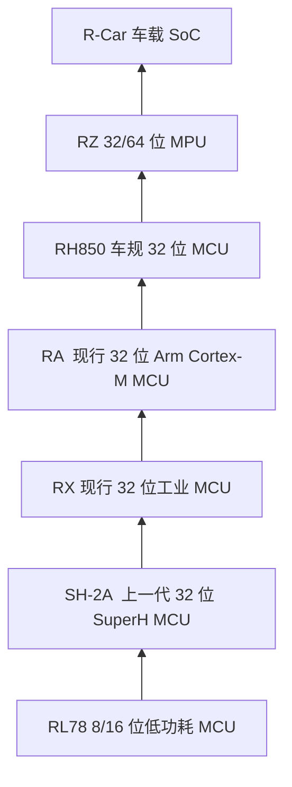

# 固件镜像输出与瑞萨产品定位

本文分四部分。第一部分说明本仓库两个嵌入式工程如何在 elf、mot/srec 之外再生成 HEX 和 BIN。第二部分按产品层级，从低到高排列所问的瑞萨系列。第三部分说明哪些系列能带彩色触摸屏、能跑较强 RTOS 或嵌入式 Linux。第四部分说明超低功耗、超低成本的 IoT 可选系列。

## 1. HEX 与 BIN

两个工程链接后本来就会出 elf，以及一份 Motorola S-record。RX71M 的扩展名是 `.mot`，RA8P 的扩展名是 `.srec`，格式同类。Intel HEX 和 BIN 是在这一步之后追加的，不替换原来的 mot/srec。

Objcopy 的 **OutFormat** 只能留一种。工程里这一项保持 Motorola S-record。HEX 和 BIN 走生成后步骤。

### 1.1 在 e2 studio 里看

对 `POC_RX71M` 和 `POC_RA8P` 分别打开：

**Properties → C/C++ Build → Settings → Build Steps → Post-build steps**

Debug、Release 都有同一条命令。RX71M 的 HardwareDebug 也有。命令在重新生成 makefile 之后，由 IDE 跟在链接后面执行。

不依赖这次重新生成、现在就能生效的规则在工程根目录：

| 工程 | 文件 |
|---|---|
| RX71M | `POC_RX71M/makefile.targets` |
| RA8P | `POC_RA8P/makefile.targets` |

Debug、Release 的 makefile 末尾有 `-include ../makefile.targets`。用 e2 studio 或 `ci/pipeline.ps1` 的 make 编译，都会带上 HEX 和 BIN。不要把这两条规则写进 `Debug/makefile` 或 `Release/makefile`，那两个文件会由 IDE 重新生成。

### 1.2 产物

文件出现在对应的 `Debug` 或 `Release` 目录。

| 工程 | HEX | BIN | BIN 的含义 |
|---|---|---|---|
| RX71M | `POC_RX71M.hex` | `POC_RX71M.bin`，4 MB | 片内 ROM 窗口，起始地址 `0xFFC00000`，空隙填 `0xFF`，含末尾固定向量 |
| RA8P | `POC_RA8P.hex` | `POC_RA8P.bin`，约 20 KB | 代码闪存，起始地址 `0x02000000`，只含向量和只读代码 |

HEX 带地址，适合烧录器。BIN 没有地址，烧录时必须自己指定上表的起始地址。

整份 elf 直接转 BIN 不可用。RX 的代码在 `0xFFC00000`，固定向量在 `0xFFFFFF80`，另外还有低地址段，一次转出会铺成约 4 GB。RA 的多个存储窗口会铺成十几 MB。所以 BIN 只截程序区。RA 的选项设置字节留在 HEX 里，不进 BIN。

### 1.3 命令

RX71M，工具是 `rx-elf-objcopy`。输入格式必须写 `-I elf32-rx-be-ns`，与现有 mot 规则一致。

```text
rx-elf-objcopy POC_RX71M.elf -O ihex -I elf32-rx-be-ns POC_RX71M.hex
rx-elf-objcopy POC_RX71M.elf -I elf32-rx-be-ns -O binary --gap-fill=255 -j .text -j .rvectors -j .init -j .fini -j .rodata -j .exvectors -j .fvectors POC_RX71M.bin
```

RA8P，工具是 `llvm-objcopy`。段名末尾有两个 `$`。写进 makefile 时要写成四个 `$`，并用单引号包住，否则 make 和 shell 会把 `$` 吃掉，BIN 变成 0 字节。

```text
llvm-objcopy POC_RA8P.elf -O ihex POC_RA8P.hex
llvm-objcopy POC_RA8P.elf -O binary --gap-fill=255 -j '__flash_vectors$$' -j '__flash_readonly$$' POC_RA8P.bin
```

清理工程时，这两个额外文件一并删除。

## 2. 瑞萨系列从低到高

下面按系统层级排列，不按单一主频。名单中的 RLX、RLA、RL Z 不是瑞萨现行家族名，分别对应 **RX**、**RA**、**RZ**。RL78/L1A 只是 RL78 里的一个子系列，不是独立家族。



| 顺序 | 名单写法 | 官方家族 | 层级 | 典型用途 |
|---|---|---|---|---|
| 1 | RL78 | RL78 | 8/16 位低功耗 MCU | 家电、表计、传感器、低端车身。主频大约十几到 48 MHz，强调待机电流和成本 |
| 2 | SH2A | SuperH SH-2A | 上一代 32 位 MCU | 电机、工控和一部分早期车载控制。新设计多由 RX、RA 或 RH850 接替，存量维护仍在 |
| 3 | RLX | RX | 现行 32 位 MCU，瑞萨自有内核 | 工业、办公和家电控制。本仓库的 RX71M 在这一层。RXv2/v3，常见几十到 240 MHz 一级 |
| 4 | RLA | RA | 现行 32 位 MCU，Arm Cortex-M | 与 RX 平行的 Arm 生态。内部从低到高是 RA0、RA2、RA4、RA6、RA8。RA0/RA2 可以低于中端 RX；RA8 的 Cortex-M85 可以高于常见 RX。本仓库的 RA8P1 在 RA 的高端 |
| 5 | RH850 | RH850 | 车规 32 位 MCU | 动力、底盘、车身、区域控制器。强调 AEC-Q100 和 ISO 26262，可到 ASIL-D，带锁步核。它高于一般工控 MCU 的是安全与车规，不是主频一定高于 RA8 |
| 6 | RL Z | RZ | 32/64 位 MPU | 带 MMU 或高性能实时核，跑 Linux、工业以太网或带显示的 HMI。RZ/A、RZ/G、RZ/T、RZ/N、RZ/V 都在这一层，已经离开“单片机裸机”的典型范围 |
| 7 | R-CAR | R-Car | 车载 SoC | 座舱、ADAS、网关。多核 Cortex-A，加图形和加速器。算力和软件栈都高于 RH850 和 RZ 里的实时控制型号 |

同层里不要看成严格的一条线。RX 与 RA 是两条现行 32 位 MCU 产品线，按生态和具体型号选择，不按家族名分高下。RH850 与 R-Car 同属汽车，前者是安全 MCU，后者是计算 SoC。

更早的 78K 已收进 RL78 这一档，V850 已收进 RH850 这一档。这两条没有放进上表。

## 3. 触摸屏与操作系统

彩色触摸屏指能驱动彩色 TFT，并接触摸。RL78 上的电容触摸是按键和滑条，段码 LCD 不算这种屏。强 RTOS 指 FreeRTOS、ThreadX、AUTOSAR 这一级。嵌入式 Linux 只落在有 MMU 的 MPU 和 SoC 上。μClinux 是没有 MMU 的旧路线，这些现行系列都不走它。

| 系列 | 彩色触摸屏 | 强 RTOS | 嵌入式 Linux |
|---|---|---|---|
| RL78 | 不做。只有电容按键、段码屏 | 只能上很轻的 RTOS，RAM 太小 | 不能 |
| SH-2A | 旧型号里有带 LCD 控制器的，触摸靠外接芯片 | 能，μITRON 一类，属于存量 | 不能。SH-2A 没有 MMU |
| RX | 家族里 RX65N、RX72N 等有图形 LCD，可做 HMI，触摸外接。RX71M 本身不是显示型号 | 能，官方 FreeRTOS。本仓库就是这样 | 不能 |
| RA | RA6M3、RA8D 有图形和 2D，部分有 MIPI DSI，适合触摸屏。触摸可以是片上电容，也可以外接控制芯片。RA8P1 是 AI 和高性能型号，不是显示主型号 | 能，FreeRTOS 和 ThreadX。本仓库的 RA8P 走 FreeRTOS | 不能。Cortex-M 没有 MMU |
| RH850 | 仪表组 RH850/D1x 能驱动车载显示。触摸不是它的主用途 | 能，车用 AUTOSAR OS / RTOS | 不能 |
| RZ | 能。RZ/A 面向 TFT HMI；RZ/G、RZ/V 跑 Linux 图形界面。触摸一般外接 | 能。RZ/A、RZ/T、RZ/N 常用 RTOS；带 Cortex-R 的型号实时性更强 | 能。RZ/G、RZ/V、RZ/Five，以及 RZ/T2H 里的 Cortex-A |
| R-Car | 能。多屏、座舱和 ADAS 显示 | 能。实时核跑 RTOS | 能。Cortex-A 上跑 Linux 或 Android |

裸机或 FreeRTOS 的工业 HMI 看 RX65N、RX72N 和 RA6、RA8D。要 Linux 图形界面看 RZ/G、RZ/A。座舱和多屏看 R-Car。本仓库的 RX71M 和 RA8P1 只适合强 RTOS，不适合作为触摸屏主控，也不能上 Linux。

## 4. 超低功耗与超低成本的 IoT

这一档只看电池或能量采集能撑久、单价压得低的节点。显示、Linux 和车规计算不在这里。

| 优先顺序 | 系列 | 适合的 IoT 节点 | 说明 |
|---|---|---|---|
| 1 | RL78，尤其 G15、G16、G22、G23 | 传感器、表计、家电从机、简单无线节点 | 现行目录里最贴超低功耗和超低成本。运行电流可以到约 37.5 μA/MHz 这一级，待机更低。G15、G16 引脚少、闪存小，成本更低；G22、G23 待机和触摸按键更完整 |
| 2 | RA0 | 希望用 Arm 工具链、又要把 32 位价格压到接近 8/16 位的节点 | Cortex-M23，约 32 MHz。比 RL78 好写 32 位软件，功耗和价格仍留在入门档 |
| 3 | RA2，尤其 RA2L1 一类 | 端点、表计、带更多外设的电池设备 | 仍是 Cortex-M23，超低功耗比 RA0 更常被选来做电池端点。外设比 RA0 多，价格也上去一截 |
| 4 | RX100，尤其 RX140 | 必须沿用 RX 工具链的低功耗节点 | 32 位自有内核里的低功耗组。能跑 FreeRTOS，但成本和功耗都高于 RL78、RA0 |

RH850、RZ、R-Car、SH-2A，以及 RA4 以上、RX600、RX700，都不进这一档。RA4、RA6 里带 BLE 或 Wi-Fi 的型号能做物联网，单价和功耗已经离开超低成本。

无线节点通常是 RL78 或 RA2 再外接 Sub-GHz、BLE 模组。这样主控仍留在超低功耗档，射频不进 MCU 单价。
