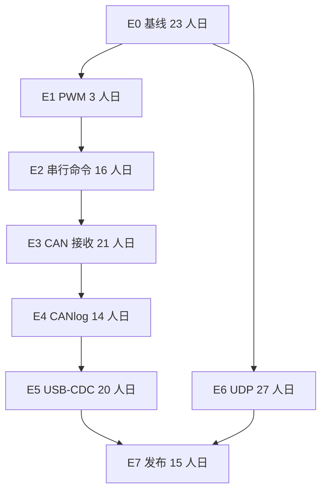
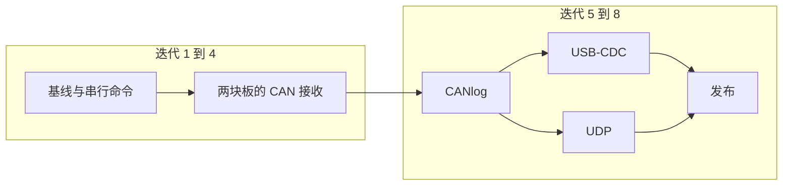

# 项目任务分解

本文把当前委托需求拆成可以按测试驱动、分迭代交付的 story，并给出 1 人和 3 人两套排期。现状以 `software_architecture.md` 为准，协议以 `host_link_protocol.md` 为准，已实现功能的实机用例以 `system_test_design.md` 为准。

日文版见 `project_backlog_ja.md`。

## 1. 口径

工数：1 人日 = 8 小时，1 人月 = 20 人日。迭代长度 2 周。起始日定为 2026-11-02，该日是周一。

一人配置的执行者就是三人配置里的负责人 A，单独完成全部 story。每个迭代为管理 2 人日、开发 6 人日、共有开销 2 人日。三人配置里 A 是管理 3 人日、开发 5 人日、共有开销 2 人日。B 和 C 是开发 8 人日、共有开销 2 人日。分项见第 4 节和第 5 节。

已有 PoC 继续用，不推倒重写。PC 上位机算在本计划内。

下列口径在第一迭代写成一页假设，之后的 story 都按它验收。客户若改口径，只重估受影响的 story。

| 事项 | 本计划采用的口径 |
|---|---|
| CAN FD | 只有 RA8P 发送和接收。RX71M 保持经典 CAN，收到 `fd=true` 仍回答不支持 |
| CANlog | RAM 环形缓冲，256 帧，掉电不保留。不做 Flash 或 SD |
| PC 主链路 | 业务 UART 上的 HL1。USB-CDC 以后承载同一套 HL1 字节 |
| 以太网 | IPv4 UDP。板卡周期发送状态，PC 显示。不做网页、TLS 和通用 TCP 服务 |
| SPI / I2C / LIN | 各增加一条上位机命令，完成一次传输。不做成通用驱动框架 |
| 性能 | 在客户给出新指标前，沿用现在的 115200、CAN 500 kbit/s、PWM 1 kHz |
| 文档 | 行为变化时，中文和日文各改各的文件 |

## 2. 每个 story 的 TDD 循环

story 的工数已经含测试，不另加一轮“补测试”。


关门条件：

- 协议或 PC 上先有失败测试，实现后变绿。固件行为能在 `protocol/selftest.c` 或板级回调测试里复现的，不把示波器当唯一测试。
- `ci/pipeline.ps1 -Stage protocol,host` 通过。触及固件时，对应板的 Debug 构建通过。迭代最后一个 story 再跑 Release。
- 实机步骤有记录：板卡、Debug 或 Release、期望、实际。
- 行为有变化时，更新对应语言的协议或结构文档。

## 3. Story 一览

合计 **139 人日**，约 **7.0 人月**。这是两套配置共用的工作量。人数改变的是日历，不把同一份工作算两遍。

### E0 把现有 PoC 钉成回归基线

| ID | Story | 人日 | 先写的测试 | 前置 |
|---|---|---:|---|---|
| E0-S1 | 把第 1 节口径写成验收假设，并标出不做 Flash 日志 | 1 | 无代码测试。评审记录即验收 | 无 |
| E0-S2 | 为已有 HL1 补特征测试：错误 CRC 丢弃、板卡号过滤、序号分段、掩码 0 | 3 | 扩展 `selftest.c` 与 `hl_check`，先看到失败再补断言 | E0-S1 |
| E0-S3 | 按系统测试设计执行现有功能的 P1 实机基线 | 12 | 用现成 P1 用例当验收，失败先记账，不在本 story 里加功能 | E0-S2 |
| E0-S4 | 登记标签为 `renesas` 的自托管运行器，使 firmware 工作流可运行 | 2 | 推一次 `pcsoft` 后，托管作业与自托管作业都为绿 | E0-S1 |
| E0-S5 | 按外设拆开 `board_resources.cpp`。先锁住现有字节和引脚行为，再搬家 | 5 | E0-S2 的测试在拆分前后都绿 | E0-S2 |

小计 23 人日。

### E1 修正 PWM 通道

| ID | Story | 人日 | 先写的测试 | 前置 |
|---|---|---:|---|---|
| E1-S1 | RX71M 四路 PWM 与资源表的比较寄存器一致。RA 通道保持不变 | 3 | 先写通道 0–3 对应比较寄存器的期望，再改赋值 | E0-S5 |

### E2 让 SPI、I2C、LIN 成为上位机命令

| ID | Story | 人日 | 先写的测试 | 前置 |
|---|---|---:|---|---|
| E2-S1 | 增加一次 SPI 交换命令。两块板都执行，结果回在 Ack 或 Snapshot 的约定字段 | 5 | 先改 proto 黄金字节和自检，红灯后再写固件 | E0-S5 |
| E2-S2 | 增加一次 I2C 写命令。地址与 1 字节数据由上位机给出 | 4 | 同上，缺字段和非法地址先有失败用例 | E2-S1 |
| E2-S3 | 增加 LIN：Break 后发送上位机给出的数据，而不只发 `0x55` | 4 | 先固定 Break 之后的字节序列测试 | E2-S1 |
| E2-S4 | 上位机增加这三条命令的输入和日志 | 3 | Pascal 黄金向量先失败，再接界面 | E2-S1 |

小计 16 人日。演示循环可以保留，但不得覆盖上位机刚写的 SPI、I2C、LIN 结果。

### E3 CAN 接收

| ID | Story | 人日 | 先写的测试 | 前置 |
|---|---|---:|---|---|
| E3-S1 | RX71M 两路接收经典帧，收到后写入 CanLog，`tx=false` | 8 | 先用回调测试喂入一帧，断言 CanLog；再接邮箱 | E0-S5 |
| E3-S2 | RA8P 两路接收。经典帧和 CAN FD 都入 CanLog，`fd` 与帧类型一致 | 8 | 先区分 `fd` 真假的解码测试，再写接收邮箱 | E0-S5 |
| E3-S3 | 增加 11 位 ID 过滤。未通过过滤的帧不入日志 | 5 | 先写通过与拒绝两个向量 | E3-S1、E3-S2 |

小计 21 人日。RX71M 不实现 CAN FD 接收。

### E4 CANlog RAM 缓冲

| ID | Story | 人日 | 先写的测试 | 前置 |
|---|---|---:|---|---|
| E4-S1 | 256 帧环形缓冲。写满后覆盖最旧帧，掉电不保留 | 6 | 先在主机侧用同一组向量把缓冲算法跑红再跑绿，固件调用同一逻辑 | E3-S3 |
| E4-S2 | 上位机按页读取和清空缓冲 | 5 | 先固定分页编码的黄金字节 | E4-S1 |
| E4-S3 | 发送帧和接收帧都入库。未连接时只入库，连接后按页上传 | 3 | 先断言未连接时 `linked=0` 不发送 | E4-S1 |

小计 14 人日。

### E5 USB-CDC

| ID | Story | 人日 | 先写的测试 | 前置 |
|---|---|---:|---|---|
| E5-S1 | RX71M USB-CDC 承载与 UART 相同的 HL1 字节 | 8 | 解析器测试复用 E0-S2。新增枚举后的 PING 实机验收 | E4-S3 |
| E5-S2 | RA8P USB-CDC 做同样的事 | 8 | 同上 | E4-S3 |
| E5-S3 | 上位机可在 COM 与 CDC 之间选择，帧格式不变 | 4 | 选择 CDC 时仍走 `uHostLink` 的同一套编码测试 | E5-S1 |

小计 20 人日。CDC 不稳定时，UART 仍是验收通路。

### E6 以太网 UDP

| ID | Story | 人日 | 先写的测试 | 前置 |
|---|---|---:|---|---|
| E6-S1 | 确认 PHY 地址、地址族和 UDP 端口，写成一页接口说明 | 1 | 无产品代码。接口说明被 E6-S2 的测试引用 | E0-S1 |
| E6-S2 | RX71M 经 RMII 周期发送 UDP 状态包 | 10 | 先固定状态包字节布局的主机测试，再接网卡 | E6-S1、E0-S5 |
| E6-S3 | RA8P 经 RGMII 做同样的状态包 | 12 | 复用 E6-S2 的字节测试 | E6-S1、E0-S5 |
| E6-S4 | 上位机接收 UDP 并显示，不取代 HL1 命令通道 | 4 | 先用录好的 UDP 包驱动界面测试 | E6-S2 |

小计 27 人日。RGMII 的 PHY 若未就绪，E6-S3 停在接口测试，不阻塞 UART 发布。

### E7 发布

| ID | Story | 人日 | 先写的测试 | 前置 |
|---|---|---:|---|---|
| E7-S1 | 按系统测试设计重跑 P1，并补本计划新增命令的实机项 | 12 | 新增命令沿用各 story 已写的失败测试，实机只做端到端 | E2、E4、E5、E6-S2 |
| E7-S2 | 更新中日文档，打 `v*` 标签，确认 release 工作流产物 | 3 | release 工作流把 `ci/out` 打成构件 | E7-S1 |

小计 15 人日。



E6 只依赖基线，日历上可以和 E3–E5 并行。1 人配置仍按上图顺序做，避免同时打开两条硬件线。

## 4. 一人配置

一人配置的执行者就是三人配置里的负责人 A，单独完成全部 story，没有 B 和 C。

管理仍然单列。单独工作时每个迭代是 2 人日，不是三人时的 3 人日。少掉的 1 人日是带领另外两名工程师的对齐；客户沟通、计划、风险和验收记录保留。另外 2 人日仍是共有开销，开发是 6 人日。

开发池 24 × 6 = 144 人日，story 为 139 人日，末尾余 5 人日。管理 24 × 2 = 48 人日。共有开销 24 × 2 = 48 人日。报价出勤 24 × 10 = **240 人日**，即 12.0 人月。

日历：2026-11-02 至 2027-10-01。

| 迭代 | 日期 | 完成的 story | story 人日 |
|---|---|---|---:|
| 1 | 11-02 ～ 11-13 | E0-S1、E0-S2、E0-S4 | 6 |
| 2 | 11-16 ～ 11-27 | E0-S5、E0-S3 开始（1/12） | 6 |
| 3 | 11-30 ～ 12-11 | E0-S3 继续（6/12） | 6 |
| 4 | 12-14 ～ 12-25 | E0-S3 完成（5/12）、E1-S1 开始（1/3） | 6 |
| 5 | 12-28 ～ 01-08 | E1-S1 完成（2/3）、E2-S1 开始（4/5） | 6 |
| 6 | 01-11 ～ 01-22 | E2-S1 完成（1/5）、E2-S2、E2-S3 开始（1/4） | 6 |
| 7 | 01-25 ～ 02-05 | E2-S3 完成（3/4）、E2-S4 | 6 |
| 8 | 02-08 ～ 02-19 | E3-S1 开始（6/8） | 6 |
| 9 | 02-22 ～ 03-05 | E3-S1 完成（2/8）、E3-S3 开始（4/5） | 6 |
| 10 | 03-08 ～ 03-19 | E3-S3 完成（1/5）、E3-S2 开始（5/8） | 6 |
| 11 | 03-22 ～ 04-02 | E3-S2 完成（3/8）、E4-S1 开始（3/6） | 6 |
| 12 | 04-05 ～ 04-16 | E4-S1 完成（3/6）、E4-S3 | 6 |
| 13 | 04-19 ～ 04-30 | E4-S2、E5-S1 开始（1/8） | 6 |
| 14 | 05-03 ～ 05-14 | E5-S1 继续（6/8） | 6 |
| 15 | 05-17 ～ 05-28 | E5-S1 完成（1/8）、E5-S2 开始（5/8） | 6 |
| 16 | 05-31 ～ 06-11 | E5-S2 完成（3/8）、E5-S3 开始（3/4） | 6 |
| 17 | 06-14 ～ 06-25 | E5-S3 完成（1/4）、E6-S1、E6-S2 开始（4/10） | 6 |
| 18 | 06-28 ～ 07-09 | E6-S2 完成（6/10） | 6 |
| 19 | 07-12 ～ 07-23 | E6-S3 开始（6/12） | 6 |
| 20 | 07-26 ～ 08-06 | E6-S3 完成（6/12） | 6 |
| 21 | 08-09 ～ 08-20 | E6-S4、E7-S1 开始（2/12） | 6 |
| 22 | 08-23 ～ 09-03 | E7-S1 继续（6/12） | 6 |
| 23 | 09-06 ～ 09-17 | E7-S1 完成（4/12）、E7-S2 开始（2/3） | 6 |
| 24 | 09-20 ～ 10-01 | E7-S2 完成（1/3） | 1 |

迭代 5 跨年末年始。这一迭代不安排需要客户在场的实机验收。

一人兼任负责人后，USB 和以太网仍排在后半段。每个迭代结束都保持 UART 通路可演示。

## 5. 三人配置

角色固定，减少 `board_resources` 上的交叉修改。

| 角色 | 负责人 | 主要 story |
|---|---|---|
| A | 协议、上位机、测试宿主、CI | E0-S1、E0-S2、E0-S4、E2 的黄金向量、E2-S4、E4-S2、E5-S3、E6-S1、E6-S4、E7-S2 |
| B | RX71M | E1-S1、RX 侧串行与 CAN 接收、E5-S1、E6-S2 |
| C | RA8P | RA 侧串行与 CAN FD 接收、E5-S2、E6-S3 |

E0-S3 的实机由 B 和 C 轮流操作同一套板，A 记录期望和实际。工数仍是 12，不乘 3。E0-S5、E4-S1、E4-S3、E7-S1 按板或按测试文件分人，工数相加等于故事总人日。

### 职责边界

A 兼任负责人，不另加第四个人。B 和 C 没有管理工数。

| 事项 | A 负责人 | B RX71M | C RA8P |
|---|---|---|---|
| 迭代计划、客户沟通、风险和验收记录 | 做。对外日期只由 A 承诺 | 参加评审 | 参加评审 |
| 协议字段和黄金向量 | 先写失败测试并合入 | 按测试改 RX | 按测试改 RA |
| 上位机、CI、发布说明 | 做 | 提供 RX 的已知限制 | 提供 RA 的已知限制 |
| RX 寄存器和外设 | 只评审与协议相接的回调 | 做 | 不改 RX 工程 |
| RA 寄存器、CAN FD、RGMII | 只评审回调 | 不改 RA 工程 | 做 |
| 实机操作 | 记录，不连续占用板子 | 值板做 RX | 值板做 RA |

### 预算里的管理工数

报价按出勤计算。story 的 139 人日是开发工作量，不乘人数，也不要把管理再加一遍。

三人各出勤 8 个迭代 × 10 人日 = 80，合计 **240 人日**。

A 每个迭代的 10 人日拆成三行。管理从 A 的开发里扣，不加在 240 之外。

| 用途 | 每迭代 | 8 个迭代 |
|---|---:|---:|
| 管理：计划、客户沟通、风险、验收记录、评审主持 | 3 | 24 |
| 开发：协议、上位机、CI、文档 | 5 | 40 |
| 共有开销：和 B、C 一样参加技术评审与流水线 | 2 | 16 |

B 和 C 没有管理行。每人是开发 8 人日、共有开销 2 人日。

| 科目 | 人日 |
|---|---:|
| A 管理 | 24 |
| A 开发 | 40 |
| B 开发 | 64 |
| C 开发 | 64 |
| 三人共有开销 | 48 |
| 出勤合计 | 240 |

开发池是 40 + 64 + 64 = **168 人日**。139 个 story 人日放在这里，余下 **29 人日** 给实机排队、年末和集成。日历仍是 8 个迭代，到 2027-02-19。

评估时用下面的式子。管理只乘 A 的天数，不乘 3。24 也不要再加到 139 上然后乘人数。

```text
报价人日 = 3 × 迭代数 × 10
管理工数 = 迭代数 × 3
开发工数 = 迭代数 × (5 + 8 + 8)
```

若把 A 的管理提到每迭代 5 人日，A 的开发只剩 3 人日，共有开销仍是 2。开发池变为每迭代 19 人日，8 个迭代共 152。152 − 139 = 13，余量偏紧。这时增加第 9 个迭代，结束日改为 2027-03-05。管理变为 45 人日，出勤变为 270 人日，开发池变为 171 人日。

日历：2026-11-02 至 2027-02-19。

| 迭代 | 日期 | A | B | C | 迭代目标 |
|---|---|---|---|---|---|
| 1 | 11-02 ～ 11-13 | E0-S1、E0-S2 | E0-S5 的 RX 部分，准备实机 | E0-S5 的 RA 部分，准备实机 | 特征测试变绿，文件拆开 |
| 2 | 11-16 ～ 11-27 | E0-S4，开始 E2 黄金向量 | E0-S3 的 RX 用例 | E0-S3 的 RA 用例 | 基线 P1 有记录，firmware 作业可跑 |
| 3 | 11-30 ～ 12-11 | E2-S4 与三条命令的失败测试 | E1-S1，RX 的 SPI/I2C/LIN | RA 的 SPI/I2C/LIN | E1、E2 关闭 |
| 4 | 12-14 ～ 12-25 | 接收与过滤的解码测试 | E3-S1 | E3-S2 | 两块板都能收帧 |
| 5 | 12-28 ～ 01-08 | E3-S3 的测试向量，E4 缓冲的主机实现 | 过滤的 RX 侧 | 过滤的 RA 侧 | 只做不依赖客户联机的工作 |
| 6 | 01-11 ～ 01-22 | E4-S2 | E4-S1、E4-S3 的 RX 接入 | E4-S1、E4-S3 的 RA 接入 | CANlog 可翻页 |
| 7 | 01-25 ～ 02-05 | E5-S3、E6-S1、E6-S4 的录包测试 | E5-S1、E6-S2 | E5-S2、E6-S3 | CDC 与 UDP 分板推进 |
| 8 | 02-08 ～ 02-19 | E7 记录与 E7-S2 | E7 的 RX 回归 | E7 的 RA 回归 | 打 `v*` 标签 |

迭代 7 若 RGMII 的 PHY 未就绪，C 把 E6-S3 停在字节测试，空出的时间加入 E7 的 RA 回归。发布不因此改期，UDP 作为已知限制写进 E7-S2。



## 6. 两套配置对照

| 项目 | 1 人 | 3 人 |
|---|---|---|
| 工作量 | 139 人日 | 139 人日 |
| 执行者 | 负责人 A，单独工作 | A 任负责人，B 做 RX，C 做 RA |
| 报价出勤 | 240 人日（24 × 10） | 240 人日（3 × 8 × 10） |
| 其中管理 | 48 人日，每迭代 2 人日 | 24 人日，只计 A，每迭代 3 人日 |
| 开发池 | 144 人日（24 × 6） | 168 人日（A 5 + B 8 + C 8，再乘 8 个迭代） |
| 共有开销 | 48 人日（24 × 2） | 48 人日（3 × 8 × 2） |
| 迭代数 | 24 | 8 |
| 日历 | 2026-11-02 ～ 2027-10-01 | 2026-11-02 ～ 2027-02-19 |
| 容量差额 | 144 − 139 = 5 人日，留给回归溢出 | 168 − 139 = 29 人日，留给排队、年末和集成 |
| 演示节奏 | 每个迭代结束，UART 通路保持可演示 | 迭代 2 结束有基线演示，迭代 4 结束有 CAN 接收演示 |
| 主要风险 | 以太网和 USB 的问题在 2027 年中才暴露 | 年末年始、实机只有一套、RX 与 RA 的合并 |

3 人不能把 139 人日除以 3 得到日历。E0-S3 和 E7-S1 必须串行占用实机，E6-S3 还依赖 PHY。并行的是两块板的固件和 PC 测试。

## 7. 迭代内的固定节奏

每个迭代 10 个工作日。一人配置是管理 2 人日、开发 6 人日、共有开销 2 人日。三人配置里 A 是管理 3 人日、开发 5 人日、共有开销 2 人日。B 和 C 是开发 8 人日、共有开销 2 人日。

| 时间 | 内容 |
|---|---|
| 第 1 天 | 选出本迭代 story，把失败测试的名字写进任务 |
| 第 2～8 天 | 红、绿、整理。每天至少跑一次 `protocol,host` |
| 第 9 天 | 实机验收。3 人配置由当天值板的人操作，另外两人处理失败测试 |
| 第 10 天 | 修回归，更新文档，确认流水线。不往本迭代加新 story |

story 在第 9 天实机未过，就留到下一迭代，不在第 10 天扩范围。
