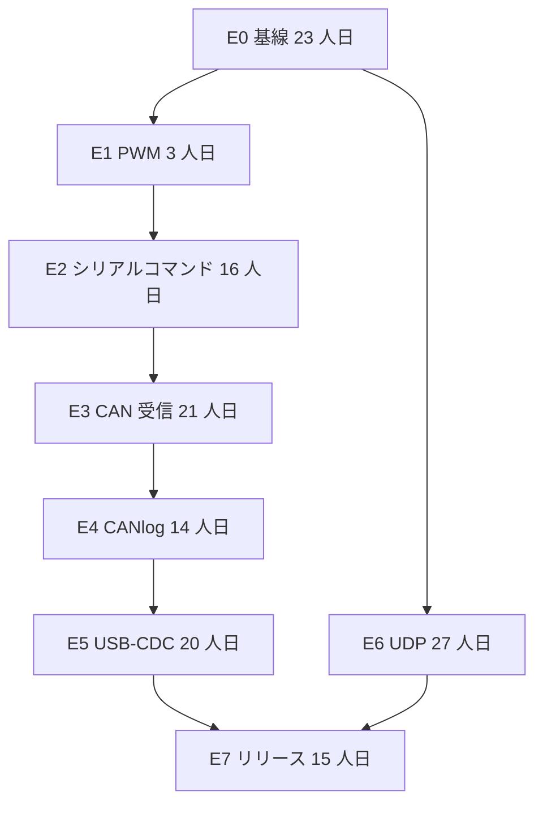
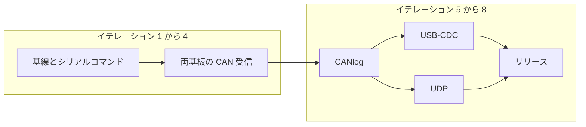

# プロジェクトタスク分解

本文は、現在の委託要求を、テスト駆動でイテレーション配信できる story に分解し、1 名と 3 名の二通りの日程を示す。現状は `software_architecture_ja.md`、プロトコルは `host_link_protocol_ja.md`、実装済み機能の実機項目は `system_test_design_ja.md` に従う。

中国語版は `project_backlog.md` を参照する。

## 1. 前提

工数は 1 人日 = 8 時間、1 人月 = 20 人日。イテレーションは 2 週間。開始日は 2026-11-02、月曜日とする。

1 名の体制の実行者は、3 名の体制の責任者 A であり、story を単独で行う。各イテレーションは管理 2 人日、開発 6 人日、共通の間接 2 人日である。3 名の体制では A が管理 3 人日、開発 5 人日、共通の間接 2 人日である。B と C は開発 8 人日、共通の間接 2 人日である。内訳は第 4 節と第 5 節。

既存の PoC は使い続ける。作り直さない。PC ホストはこの計画に含める。

次の前提は第 1 イテレーションで 1 枚に書き、以後の story はこれに対して受け入れる。顧客が前提を変えた場合は、影響する story だけを見積もり直す。

| 事項 | この計画で採用する前提 |
|---|---|
| CAN FD | 送受信とも RA8P のみ。RX71M はクラシック CAN のまま。`fd=true` には非対応と応答する |
| CANlog | RAM のリングバッファ、256 フレーム。電源を切ると消える。Flash も SD も作らない |
| PC の主経路 | 業務 UART 上の HL1。USB-CDC は後から同じ HL1 バイトを運ぶ |
| Ethernet | IPv4 UDP。基板が周期的に状態を送り、PC が表示する。Web、TLS、汎用 TCP サービスは作らない |
| SPI / I2C / LIN | それぞれホストコマンドを一つ追加し、転送を一回行う。汎用ドライバ框架にはしない |
| 性能 | 顧客が新しい指標を出すまで、現行の 115200、CAN 500 kbit/s、PWM 1 kHz を使う |
| 文書 | 動作が変わったら、中国語と日本語はそれぞれのファイルを更新する |

## 2. 各 story の TDD サイクル

story の工数にはテストが含まれている。テストのための別ラウンドは積まない。


完了条件：

- プロトコルまたは PC に、先に失敗するテストがある。実装後に成功へ変わる。ファームウェアの動作を `protocol/selftest.c` または基板コールバックのテストで再現できるものは、オシロスコープだけをテストにしない。
- `ci/pipeline.ps1 -Stage protocol,host` が成功する。ファームウェアに触れた場合は、対象基板の Debug ビルドが成功する。イテレーション最後の story で Release を実行する。
- 実機の記録に、基板、Debug か Release か、期待、実際が残る。
- 動作が変わった場合は、対応する言語のプロトコルまたは構成文書を更新する。

## 3. Story 一覧

合計 **139 人日**、約 **7.0 人月**。二つの体制で共通の作業量である。人数が変えるのは暦日であり、同じ作業を二重には数えない。

### E0 既存 PoC を回帰の基線にする

| ID | Story | 人日 | 先に書くテスト | 前提 |
|---|---|---:|---|---|
| E0-S1 | 第 1 節の前提を受け入れ仮定として 1 枚に書き、Flash ログをやらないと明記する | 1 | コードのテストはない。レビュー記録が受け入れ | なし |
| E0-S2 | 既存 HL1 の特徴テストを足す。CRC 誤りは破棄、基板番号の選別、シーケンスの分離、マスク 0 | 3 | `selftest.c` と `hl_check` を拡張し、失敗を見てからアサーションを足す | E0-S1 |
| E0-S3 | システムテスト設計に従い、既存機能の P1 実機基線を実施する | 12 | 既存の P1 を受け入れにする。失敗は記録し、この story では機能を足さない | E0-S2 |
| E0-S4 | ラベル `renesas` のセルフホストランナーを登録し、firmware ワークフローを実行可能にする | 2 | `pcsoft` へ一度 push し、ホスト実行とセルフホストの両方が成功する | E0-S1 |
| E0-S5 | `board_resources.cpp` を周辺機能ごとに分割する。既存のバイト列とピン動作を固定してから移す | 5 | E0-S2 のテストが分割の前後で成功する | E0-S2 |

小計 23 人日。

### E1 PWM チャネルの修正

| ID | Story | 人日 | 先に書くテスト | 前提 |
|---|---|---:|---|---|
| E1-S1 | RX71M の PWM 四チャネルをリソース表の比較レジスタと一致させる。RA のチャネルは維持する | 3 | チャネル 0–3 と比較レジスタの対応を先に書き、その後に代入を直す | E0-S5 |

### E2 SPI、I2C、LIN をホストコマンドにする

| ID | Story | 人日 | 先に書くテスト | 前提 |
|---|---|---:|---|---|
| E2-S1 | SPI 交換を一回行うコマンドを追加する。両基板が実行し、結果は Ack または Snapshot の取り決めフィールドで返す | 5 | proto の基準バイトと自己試験を先に変え、失敗してからファームウェアを書く | E0-S5 |
| E2-S2 | I2C 書き込みを一回行うコマンドを追加する。アドレスと 1 バイトはホストが指定する | 4 | フィールド不足と不正アドレスの失敗用例を先に書く | E2-S1 |
| E2-S3 | LIN を追加する。Break のあと、ホストが渡したデータを送る。`0x55` だけにしない | 4 | Break のあとのバイト列を先に固定する | E2-S1 |
| E2-S4 | ホストにこの三コマンドの入力とログを追加する | 3 | Pascal の基準バイトを先に失敗させ、その後に画面へつなぐ | E2-S1 |

小計 16 人日。デモ循環は残してよい。ホストが直前に書いた SPI、I2C、LIN の結果は上書きしない。

### E3 CAN 受信

| ID | Story | 人日 | 先に書くテスト | 前提 |
|---|---|---:|---|---|
| E3-S1 | RX71M の二系統でクラシックフレームを受信し、CanLog に書く。`tx=false` | 8 | コールバックテストで一フレームを渡し、CanLog を確認してからメールボックスへつなぐ | E0-S5 |
| E3-S2 | RA8P の二系統で受信する。クラシックと CAN FD を CanLog に入れ、`fd` はフレーム種別と一致する | 8 | `fd` の真偽を分ける復号テストを先に書き、その後に受信メールボックスを書く | E0-S5 |
| E3-S3 | 11 ビット ID のフィルタを追加する。通らないフレームはログに入れない | 5 | 通過と拒否の二つのベクトルを先に書く | E3-S1、E3-S2 |

小計 21 人日。RX71M に CAN FD 受信は作らない。

### E4 CANlog の RAM バッファ

| ID | Story | 人日 | 先に書くテスト | 前提 |
|---|---|---:|---|---|
| E4-S1 | 256 フレームのリングバッファ。満杯後は最古を上書きする。電源を切ると消える | 6 | 同じベクトルでホスト側のバッファ算法を先に失敗させ、成功させてから、ファームウェアが同じ論理を呼ぶ | E3-S3 |
| E4-S2 | ホストがページ単位で読み、バッファを消去する | 5 | ページ符号化の基準バイトを先に固定する | E4-S1 |
| E4-S3 | 送信フレームと受信フレームの両方を格納する。未接続時は格納のみ、接続後にページで送る | 3 | 未接続の `linked=0` では送信しないことを先に確認する | E4-S1 |

小計 14 人日。

### E5 USB-CDC

| ID | Story | 人日 | 先に書くテスト | 前提 |
|---|---|---:|---|---|
| E5-S1 | RX71M の USB-CDC が、UART と同じ HL1 バイトを運ぶ | 8 | パーサ試験は E0-S2 を再利用する。列挙後の PING 実機を追加する | E4-S3 |
| E5-S2 | RA8P の USB-CDC で同じことを行う | 8 | 同上 | E4-S3 |
| E5-S3 | ホストが COM と CDC を選べる。フレーム形式は変えない | 4 | CDC を選んでも `uHostLink` の同じ符号化テストを通る | E5-S1 |

小計 20 人日。CDC が不安定でも、UART を受け入れ経路として残す。

### E6 Ethernet UDP

| ID | Story | 人日 | 先に書くテスト | 前提 |
|---|---|---:|---|---|
| E6-S1 | PHY アドレス、アドレスファミリ、UDP ポートを確認し、インタフェース説明を 1 枚にする | 1 | 製品コードはない。E6-S2 のテストがこの説明を参照する | E0-S1 |
| E6-S2 | RX71M が RMII 経由で UDP 状態パケットを周期送信する | 10 | 状態パケットのバイト配置をホストテストで先に固定し、その後にネットワークへつなぐ | E6-S1、E0-S5 |
| E6-S3 | RA8P が RGMII 経由で同じ状態パケットを送る | 12 | E6-S2 のバイトテストを再利用する | E6-S1、E0-S5 |
| E6-S4 | ホストが UDP を受信して表示する。HL1 のコマンド経路は置き換えない | 4 | 記録済みの UDP パケットで画面テストを先に動かす | E6-S2 |

小計 27 人日。RGMII の PHY が未準備なら、E6-S3 はインタフェーステストで止め、UART のリリースを止めない。

### E7 リリース

| ID | Story | 人日 | 先に書くテスト | 前提 |
|---|---|---:|---|---|
| E7-S1 | システムテスト設計の P1 を再実施し、本計画で増えたコマンドの実機項目を足す | 12 | 新しいコマンドは各 story の失敗テストを再利用し、実機は端到端だけ行う | E2、E4、E5、E6-S2 |
| E7-S2 | 中日の文書を更新し、`v*` タグを打ち、release ワークフローの成果物を確認する | 3 | release ワークフローが `ci/out` を成果物にする | E7-S1 |

小計 15 人日。



E6 が依存するのは基線だけであり、暦の上では E3 から E5 と並行できる。1 名の体制では上の順に進め、ハードウェアの作業線を同時に二本開かない。

## 4. 1 名の体制

1 名の体制の実行者は、3 名の体制の責任者 A である。story はすべてこの一名が行い、B と C はいない。

管理は別に数える。一名のときは各イテレーション 2 人日であり、3 名のときの 3 人日ではない。減る 1 人日は、他の二名を率いるためのすり合わせである。顧客連絡、計画、リスク、受け入れ記録は残す。共通の間接は 2 人日、開発は 6 人日である。

開発の枠は 24 × 6 = 144 人日。story は 139 人日で、末尾に 5 人日が残る。管理は 24 × 2 = 48 人日。共通の間接は 24 × 2 = 48 人日。見積出勤は 24 × 10 = **240 人日**、すなわち 12.0 人月である。

期間は 2026-11-02 から 2027-10-01。

| イテレーション | 日付 | 終える story | story 人日 |
|---|---|---|---:|
| 1 | 11-02 ～ 11-13 | E0-S1、E0-S2、E0-S4 | 6 |
| 2 | 11-16 ～ 11-27 | E0-S5、E0-S3 開始（1/12） | 6 |
| 3 | 11-30 ～ 12-11 | E0-S3 継続（6/12） | 6 |
| 4 | 12-14 ～ 12-25 | E0-S3 完了（5/12）、E1-S1 開始（1/3） | 6 |
| 5 | 12-28 ～ 01-08 | E1-S1 完了（2/3）、E2-S1 開始（4/5） | 6 |
| 6 | 01-11 ～ 01-22 | E2-S1 完了（1/5）、E2-S2、E2-S3 開始（1/4） | 6 |
| 7 | 01-25 ～ 02-05 | E2-S3 完了（3/4）、E2-S4 | 6 |
| 8 | 02-08 ～ 02-19 | E3-S1 開始（6/8） | 6 |
| 9 | 02-22 ～ 03-05 | E3-S1 完了（2/8）、E3-S3 開始（4/5） | 6 |
| 10 | 03-08 ～ 03-19 | E3-S3 完了（1/5）、E3-S2 開始（5/8） | 6 |
| 11 | 03-22 ～ 04-02 | E3-S2 完了（3/8）、E4-S1 開始（3/6） | 6 |
| 12 | 04-05 ～ 04-16 | E4-S1 完了（3/6）、E4-S3 | 6 |
| 13 | 04-19 ～ 04-30 | E4-S2、E5-S1 開始（1/8） | 6 |
| 14 | 05-03 ～ 05-14 | E5-S1 継続（6/8） | 6 |
| 15 | 05-17 ～ 05-28 | E5-S1 完了（1/8）、E5-S2 開始（5/8） | 6 |
| 16 | 05-31 ～ 06-11 | E5-S2 完了（3/8）、E5-S3 開始（3/4） | 6 |
| 17 | 06-14 ～ 06-25 | E5-S3 完了（1/4）、E6-S1、E6-S2 開始（4/10） | 6 |
| 18 | 06-28 ～ 07-09 | E6-S2 完了（6/10） | 6 |
| 19 | 07-12 ～ 07-23 | E6-S3 開始（6/12） | 6 |
| 20 | 07-26 ～ 08-06 | E6-S3 完了（6/12） | 6 |
| 21 | 08-09 ～ 08-20 | E6-S4、E7-S1 開始（2/12） | 6 |
| 22 | 08-23 ～ 09-03 | E7-S1 継続（6/12） | 6 |
| 23 | 09-06 ～ 09-17 | E7-S1 完了（4/12）、E7-S2 開始（2/3） | 6 |
| 24 | 09-20 ～ 10-01 | E7-S2 完了（1/3） | 1 |

イテレーション 5 は年末年始をまたぐ。この回には、顧客が立ち会う実機受け入れを置かない。

責任者を一名が兼任しても、USB と Ethernet は後半にある。各イテレーションの終わりに UART 経路をデモできる状態で残す。

## 5. 3 名の体制

役割を固定し、`board_resources` への交差する修正を減らす。

| 役割 | 担当 | 主な story |
|---|---|---|
| A | プロトコル、ホスト、テスト基盤、CI | E0-S1、E0-S2、E0-S4、E2 の基準バイト、E2-S4、E4-S2、E5-S3、E6-S1、E6-S4、E7-S2 |
| B | RX71M | E1-S1、RX 側のシリアルと CAN 受信、E5-S1、E6-S2 |
| C | RA8P | RA 側のシリアルと CAN FD 受信、E5-S2、E6-S3 |

E0-S3 の実機は B と C が同じ一式を交代で操作し、A が期待と実際を記録する。工数は 12 のままで、3 倍にはしない。E0-S5、E4-S1、E4-S3、E7-S1 は基板またはテストファイルで分ける。足し合わせが story の総人日と一致する。

### 責務の境界

A が責任者を兼任する。四人目は置かない。B と C に管理工数はない。

| 事項 | A 責任者 | B RX71M | C RA8P |
|---|---|---|---|
| イテレーション計画、顧客連絡、リスク、受け入れ記録 | 行う。対外的な日付は A だけが約束する | レビューに参加する | レビューに参加する |
| プロトコル項目と基準バイト | 失敗テストを先に書き、取り込む | テストに合わせて RX を直す | テストに合わせて RA を直す |
| ホスト、CI、リリース説明 | 行う | RX の既知の制限を出す | RA の既知の制限を出す |
| RX のレジスタと周辺機能 | プロトコルにつながるコールバックだけをレビューする | 行う | RX のプロジェクトは変更しない |
| RA のレジスタ、CAN FD、RGMII | コールバックだけをレビューする | RA のプロジェクトは変更しない | 行う |
| 実機操作 | 記録する。基板を続けて占有しない | RX の担当日に操作する | RA の担当日に操作する |

### 予算における管理工数

見積もりは出勤で計算する。story の 139 人日は開発の作業量である。人数を掛けない。管理をその上に重ねもしない。

三名とも、8 イテレーション × 10 人日 = 80 の出勤である。合計は **240 人日**。

A の 10 人日は次の三行に分ける。管理は A の開発から引き、240 の外には足さない。

| 用途 | 各イテレーション | 8 イテレーション |
|---|---:|---:|
| 管理：計画、顧客連絡、リスク、受け入れ記録、レビューの進行 | 3 | 24 |
| 開発：プロトコル、ホスト、CI、文書 | 5 | 40 |
| 共通の間接：B、C と同じく技術レビューとパイプラインに参加する | 2 | 16 |

B と C に管理の行はない。各人は開発 8 人日、共通の間接 2 人日である。

| 科目 | 人日 |
|---|---:|
| A の管理 | 24 |
| A の開発 | 40 |
| B の開発 | 64 |
| C の開発 | 64 |
| 三名の共通間接 | 48 |
| 出勤の合計 | 240 |

開発の枠は 40 + 64 + 64 = **168 人日**。139 人日の story はここへ入れ、残る **29 人日** は実機の順番待ち、年末、統合に使う。暦は 8 イテレーションのまま、2027-02-19 までである。

見積もりでは次の式を使う。管理には A の日数だけを掛け、3 は掛けない。24 を 139 に足してから人数を掛けもしない。

```text
見積人日 = 3 × イテレーション数 × 10
管理工数 = イテレーション数 × 3
開発工数 = イテレーション数 × (5 + 8 + 8)
```

A の管理を各イテレーション 5 人日まで上げると、A の開発は 3 人日になり、共通の間接は 2 のままである。開発の枠は各イテレーション 19 人日、8 回で 152 になる。152 − 139 = 13 で、余裕は狭い。そのときは第 9 イテレーションを足し、終了日を 2027-03-05 にする。管理は 45 人日、出勤は 270 人日、開発の枠は 171 人日になる。

期間は 2026-11-02 から 2027-02-19。

| イテレーション | 日付 | A | B | C | イテレーションの目標 |
|---|---|---|---|---|---|
| 1 | 11-02 ～ 11-13 | E0-S1、E0-S2 | E0-S5 の RX 部分。実機の準備 | E0-S5 の RA 部分。実機の準備 | 特徴テストが成功し、ファイルが分割される |
| 2 | 11-16 ～ 11-27 | E0-S4。E2 の基準バイトを開始 | E0-S3 の RX 項目 | E0-S3 の RA 項目 | 基線 P1 の記録があり、firmware ジョブが実行できる |
| 3 | 11-30 ～ 12-11 | E2-S4 と三コマンドの失敗テスト | E1-S1。RX の SPI/I2C/LIN | RA の SPI/I2C/LIN | E1 と E2 を閉じる |
| 4 | 12-14 ～ 12-25 | 受信とフィルタの復号テスト | E3-S1 | E3-S2 | 両基板がフレームを受信できる |
| 5 | 12-28 ～ 01-08 | E3-S3 のテストベクトル。E4 バッファのホスト実装 | フィルタの RX 側 | フィルタの RA 側 | 顧客との接続に依存しない作業だけを行う |
| 6 | 01-11 ～ 01-22 | E4-S2 | E4-S1、E4-S3 の RX 接続 | E4-S1、E4-S3 の RA 接続 | CANlog をページで見られる |
| 7 | 01-25 ～ 02-05 | E5-S3、E6-S1、E6-S4 の記録パケット試験 | E5-S1、E6-S2 | E5-S2、E6-S3 | CDC と UDP を基板ごとに進める |
| 8 | 02-08 ～ 02-19 | E7 の記録と E7-S2 | E7 の RX 回帰 | E7 の RA 回帰 | `v*` タグを打つ |

イテレーション 7 で RGMII の PHY が未準備なら、C は E6-S3 をバイトテストで止め、空いた時間を E7 の RA 回帰に入れる。リリース日は動かさない。UDP は既知の制限として E7-S2 に書く。



## 6. 二つの体制の対照

| 項目 | 1 名 | 3 名 |
|---|---|---|
| 作業量 | 139 人日 | 139 人日 |
| 実行者 | 責任者 A が単独で行う | A が責任者、B が RX、C が RA |
| 見積出勤 | 240 人日（24 × 10） | 240 人日（3 × 8 × 10） |
| うち管理 | 48 人日。各イテレーション 2 人日 | 24 人日。A のみ。各イテレーション 3 人日 |
| 開発の枠 | 144 人日（24 × 6） | 168 人日（A 5 + B 8 + C 8 を、8 イテレーション倍する） |
| 共通の間接 | 48 人日（24 × 2） | 48 人日（3 × 8 × 2） |
| イテレーション数 | 24 | 8 |
| 期間 | 2026-11-02 ～ 2027-10-01 | 2026-11-02 ～ 2027-02-19 |
| 容量の差 | 144 − 139 = 5 人日。回帰のあふれ用 | 168 − 139 = 29 人日。順番待ち、年末、統合用 |
| デモの間隔 | 各イテレーションの終わりに UART 経路をデモできる状態で残す | イテレーション 2 の終わりに基線デモ、4 の終わりに CAN 受信デモ |
| 主なリスク | Ethernet と USB の問題が 2027 年半ばまで出ない | 年末年始、実機が一式、RX と RA の統合 |

3 名だからといって、139 人日を 3 で割った暦日にはならない。E0-S3 と E7-S1 は実機を直列に使う。E6-S3 は PHY に依存する。並行できるのは、二つの基板のファームウェアと PC のテストである。

## 7. イテレーション内の固定リズム

各イテレーションは 10 営業日である。1 名の体制は管理 2 人日、開発 6 人日、共通の間接 2 人日。3 名の体制では A が管理 3 人日、開発 5 人日、共通の間接 2 人日。B と C は開発 8 人日、共通の間接 2 人日。

| 時期 | 内容 |
|---|---|
| 1 日目 | この回の story を選び、失敗させるテストの名前をタスクへ書く |
| 2～8 日目 | 赤、緑、整理。毎日少なくとも一度 `protocol,host` を実行する |
| 9 日目 | 実機受け入れ。3 名の体制では、その日の担当が操作し、他の二名は失敗テストを扱う |
| 10 日目 | 回帰を直し、文書を更新し、パイプラインを確認する。この回に新しい story は足さない |

9 日目の実機が未了の story は次のイテレーションへ残す。10 日目に範囲を広げない。
