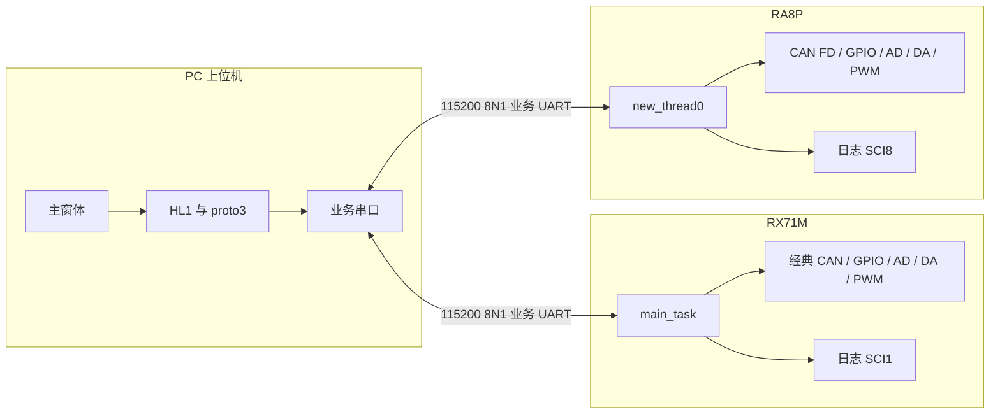
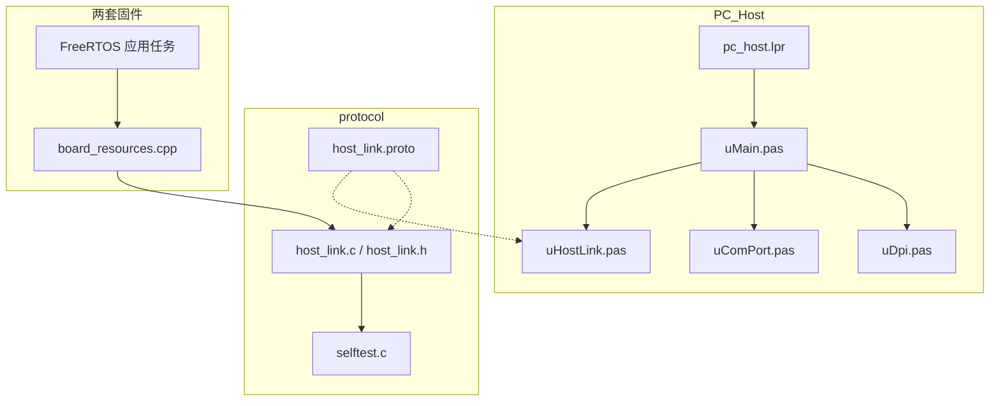
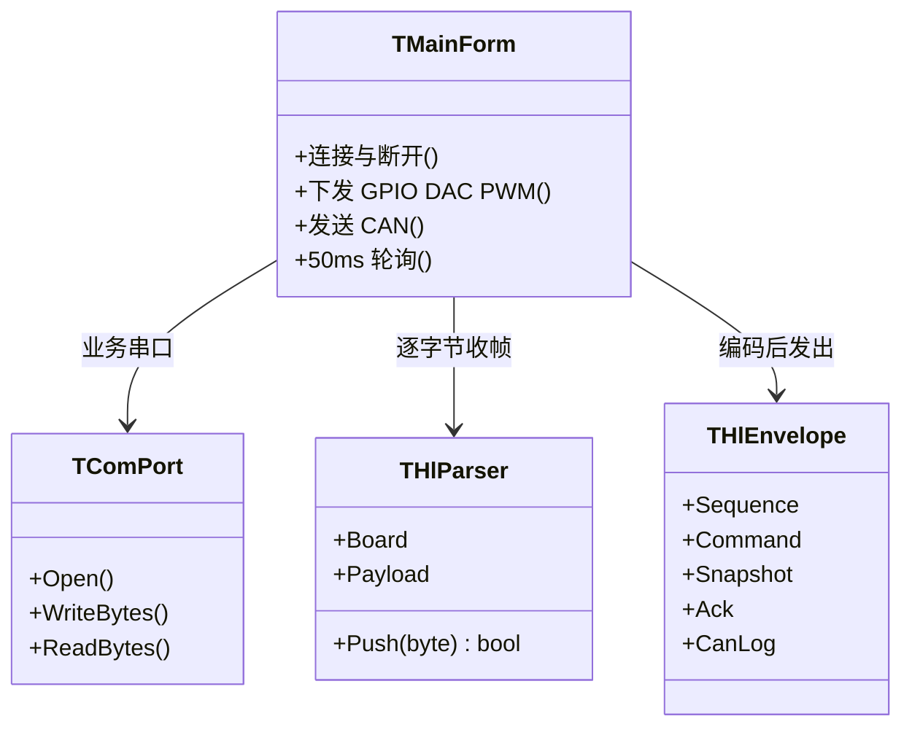
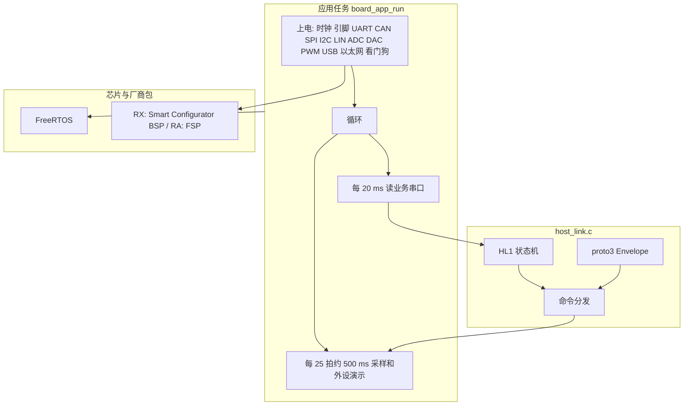
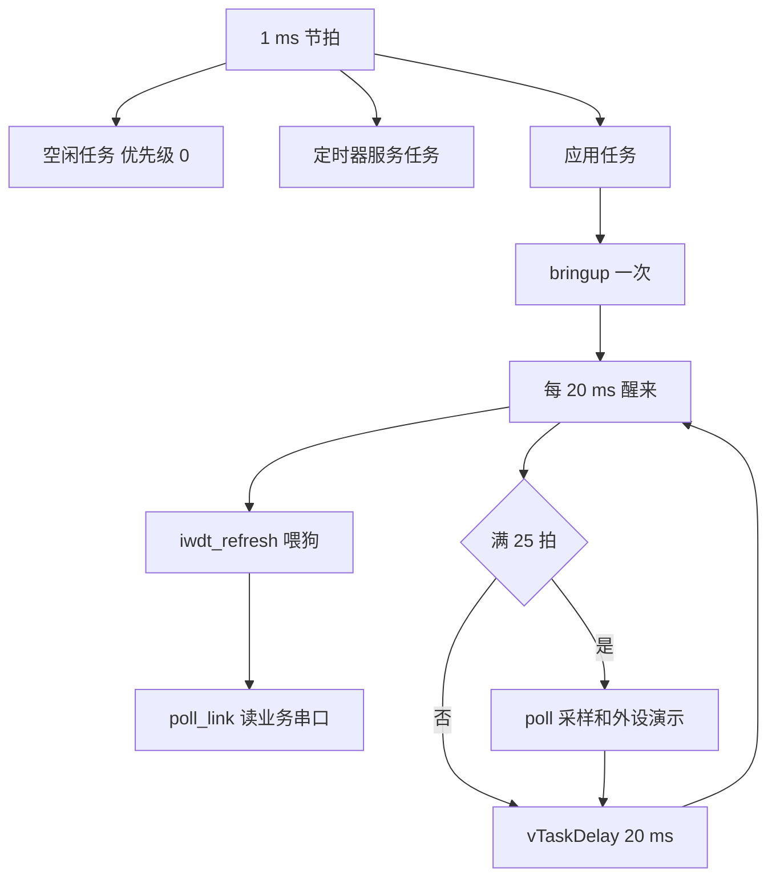
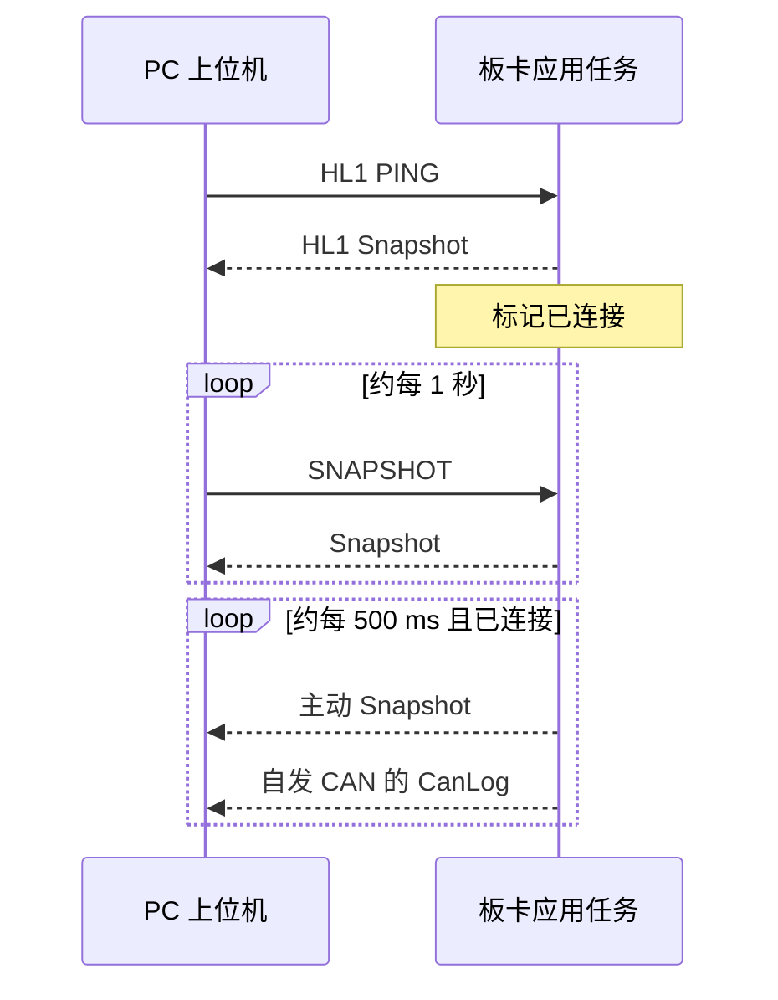
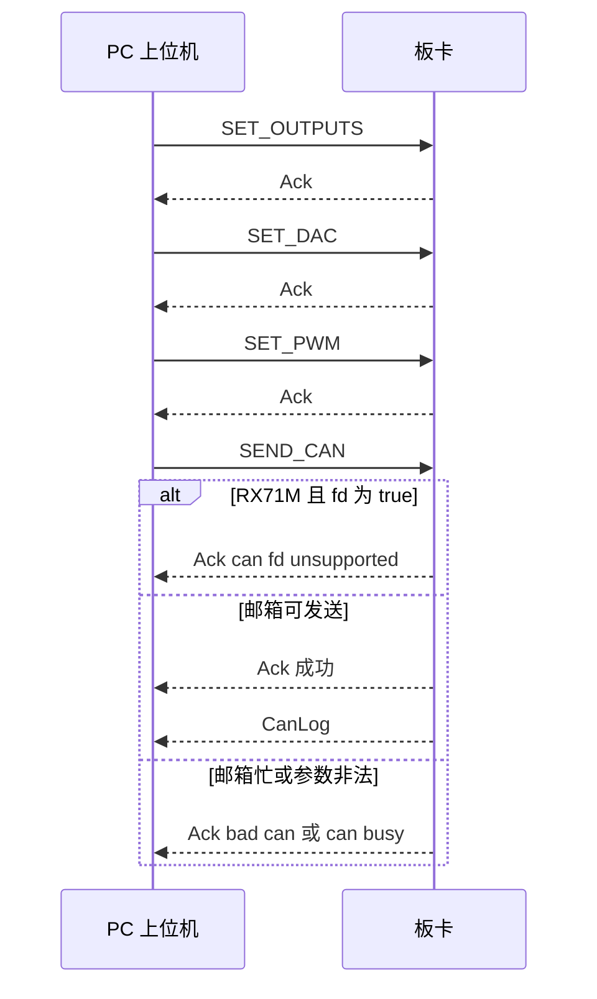
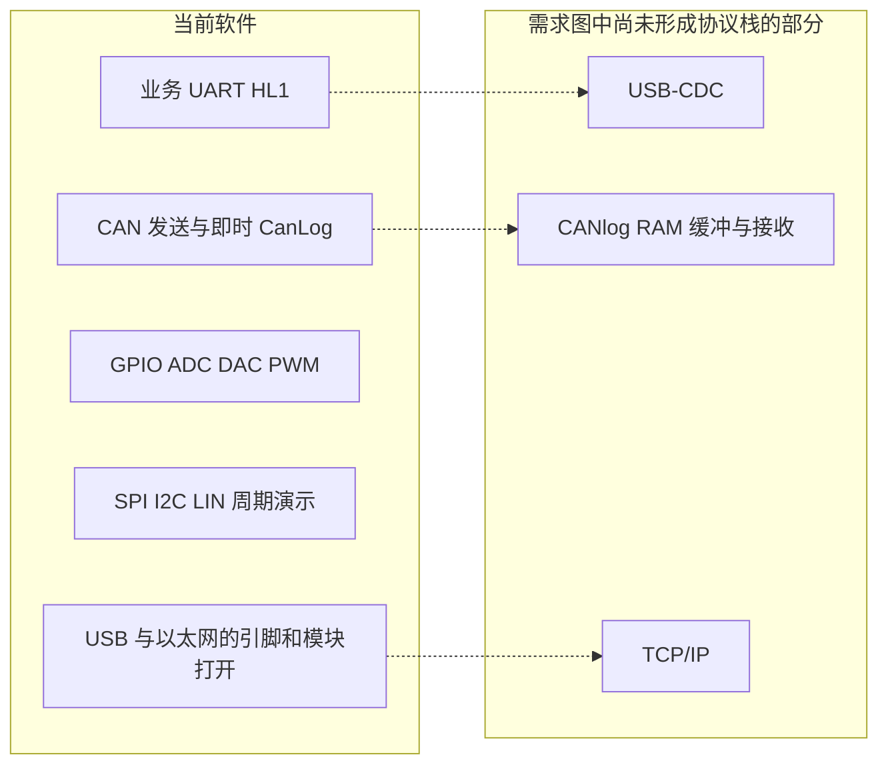

# 系统平台软件结构

本文描述仓库里已经落地的软件，不是委托需求图里的目标形态。范围包括 PC 上位机、共用 HL1 协议，以及 RX71M、RA8P 两套固件。

日文版见 `software_architecture_ja.md`。

协议正文见 `host_link_protocol.md`。引脚对照见 `mcu_resource_map.md`。目录、存储器、时钟和占用见 `workspace_layout.md`。

## 1. 仓库组成

| 目录 | 角色 |
|---|---|
| `PC_Host` | Lazarus 4.8 / FPC 3.2.2 上位机。窗体、串口、协议编解码 |
| `protocol` | 帧与 proto3 的唯一模式来源。`.proto`、C 实现、C 自检 |
| `POC_RX71M` | RX71M 固件。GCC for Renesas RX，Smart Configurator，FreeRTOS |
| `POC_RA8P` | RA8P 固件。LLVM Arm（ATfE），FSP，FreeRTOS |
| `doc` | 需求、资源表、协议和本文 |

两套固件都不链接 libprotobuf。它们在 `board_link.cpp` 里 `#include "../../../protocol/host_link.c"`，把同一份 C 编进固件。PC 用 Pascal 再实现一遍，启动时用 `HostLinkMatchesProtoc` 对照 protoc 36.2 的黄金字节。

## 2. 运行时上下文

上位机一次打开一个 COM 口，接到一块板的业务串口。日志串口只给人看文本，不进本协议。

同一时刻只接其中一路。帧里的板卡号用来声明目标：0 表示不限，1 是 RX71M，2 是 RA8P。板卡收到不是 0 也不是自己的帧时丢弃，不回答。

## 3. 逻辑结构

PC、共用协议、两套板级程序分成三条实现线，线上格式只有一套。

### 3.1 上位机

| 单元 | 职责 |
|---|---|
| `pc_host.lpr` | 打开 LCL 缩放，创建主窗体 |
| `uMain.pas` | 连接、下发、日志、50 ms 轮询 |
| `uDpi.pas` | 把按 96 PPI 书写的宽度换到当前窗体 |
| `uComPort.pas` | Windows 串口，115200 8N1，立即返回的读 |
| `uHostLink.pas` | 组帧、解帧、proto3 编解码、启动自检 |
| `tools/hl_check.lpr` | 不打开窗体，只跑同一套自检 |

窗体按设计期 PPI 摆放，`Application.Scaled` 打开，Windows 清单为 Per-Monitor V2。状态栏宽度在运行期按 96 PPI 常量重算。

### 3.2 固件共同结构

两块板各有一个应用任务，进入后不再返回。任务内部先做外设上电，然后循环。

| 板 | 任务入口 | 创建位置 | 应用主体 |
|---|---|---|---|
| RX71M | `main_task` | `freertos_user_port.c`。栈 512 字（2048 字节），优先级 3 | `POC_RX71M.c` 进入 `board_app_run()`，循环在 `board_app.cpp` |
| RA8P | `new_thread0` | `ra_gen/new_thread0.c`。静态栈 4096 字节（1024 字），优先级 1 | `new_thread0_entry.cpp` 进入 `board_app_run()`，循环在 `board_app.cpp` |

外设和协议回调按外设拆在 `src/board/board_*.cpp`。协议回调在 `board_link.cpp`，包括写业务串口、设置 GPIO、DAC、PWM、发送 CAN、填写 Snapshot。任务循环在 `board_app.cpp`。

500 ms 节拍在未连接时会改写 GPIO 和 DAC，便于示波器观察。收到第一帧合法请求后停止改写这三项，避免冲掉上位机刚写的值。SPI 交换、I2C 写地址 `0x50`、LIN Break 加 `0x55`、自发 CAN 仍然继续。

独立看门狗在 `bringup()` 的最后启动，代码在 `board_wdt.cpp`。选项字让它复位后停住，上电配置做完才开始计数。RX 专用时钟标称 15 kHz，分频 /16、计数 16384，超时约 17.5 s。RA 的同一组分频在 16384 Hz 下正好 16 s。窗口从计数起点到终点都允许刷新。任务循环每 20 ms 先 `iwdt_refresh()`，顺序是先写 `0x00` 再写 `0xFF`。下溢复位整片。片内窗口看门狗 WDT 不启动。

### 3.3 两块板的软件差异

帧、命令号、字段号相同。差异在板卡号、CAN 能力和厂商包。

| 项目 | RX71M | RA8P |
|---|---|---|
| 工程 | `POC_RX71M` | `POC_RA8P` |
| 板卡号 / 名字 | 1 / `RX71M` | 2 / `RA8P1` |
| 业务串口 | SCI2 | SCI7 |
| 日志串口 | SCI1 | SCI8 |
| CAN | 经典 CAN，拒绝 `fd=true` | CAN FD，`fd=true` 时置 FD 格式位 |
| 发出帧的 CAN FD 标志 | 不置 | 置位 |
| PWM | MTU3 / MTU4，1 kHz，通道 0–3 | GPT1 / GPT12 / GPT10，1 kHz，通道 0–3 |
| 厂商层 | `smc_gen`、RX GCC FreeRTOS 移植 | `ra/fsp`、`ra_gen`、FSP FreeRTOS 移植 |

PWM 通道号与上位机下拉框一致：0、1、2、3。占空比用千分比，0–1000。

### 3.4 FreeRTOS 配置

两边都是抢占式调度，节拍 1 ms。应用只有一个任务，协议在这个任务里轮询，没有用中断接收串口，也没有自建队列、信号量或软件定时器。内核自带的空闲任务和定时器服务任务仍然存在。

| 项目 | RX71M | RA8P |
|---|---|---|
| 配置文件 | `src/frtos_config/FreeRTOSConfig.h` | `ra_cfg/aws/FreeRTOSConfig.h` |
| 移植 | GCC RX600v2，`port.c` | FSP `rm_freertos_port` |
| 节拍 | 1000 Hz。CMT0，PCLKB 八分频，比较值按 `BSP_PCLKB_HZ / 1000 / 8 - 1`。板级把 PCLKB 当作 60 MHz | 1000 Hz。FSP 移植用 SysTick，时钟 `SystemCoreClock` |
| 调度 | 抢占，同优先级时间片打开 | 抢占，同优先级时间片关闭 |
| 优先级数量 | 7（0 最低，6 最高） | 5（0 最低，4 最高） |
| 内核中断 | 节拍优先级 `configKERNEL_INTERRUPT_PRIORITY = 1`。优先级数值大于等于 4 的中断才能调用 FreeRTOS API。0 到 3 更紧急，不能调用 | `configLIBRARY_MAX_SYSCALL_INTERRUPT_PRIORITY = 1` |
| 堆 | `heap_4.c`，动态分配，共 8 KiB | 只允许静态分配。`configTOTAL_HEAP_SIZE` 为 1024 字节，应用任务不从这里取栈 |
| 空闲任务栈 | 140 字（560 字节） | 128 字（512 字节），内存由 `ra_gen/main.c` 提供 |
| 定时器服务任务 | 优先级 6，栈 140 字，命令队列长度 5。应用没有创建软件定时器 | 优先级 3，栈 128 字，命令队列长度 10。应用没有创建软件定时器 |
| 钩子 | 空闲、节拍钩子是空函数。堆分配失败和栈溢出（检查级别 2）会关中断并停住 | 只打开空闲钩子。没有节拍钩子，没有堆失败钩子，栈溢出检查关闭 |
| 浮点上下文 | `configUSE_TASK_DPFPU_SUPPORT = 0` | 使用 FSP 端口默认 |

互斥量、递归互斥、计数信号量、事件组和流缓冲在 RX 的配置里打开了，但 `Kernel_Object_init()` 是空的，应用没有创建这些对象。RA 打开了计数信号量，互斥量关闭，应用同样没有创建内核对象。

### 3.5 任务设计

启动之后，内核里常驻的是空闲任务、定时器服务任务，以及下面这一条应用任务。没有第二个应用任务。

| 项目 | RX71M `MAIN_TASK` | RA8P `New Thread` |
|---|---|---|
| 创建 | `Processing_Before_Start_Kernel()` 里 `xTaskCreate`。失败则停在空循环 | `main()` 调用 `new_thread0_create()`，`xTaskCreateStatic`。失败走 `rtos_startup_err_callback` |
| 优先级 | 3。低于定时器服务任务 6，高于空闲任务 0 | 1。低于定时器服务任务 3，高于空闲任务 0 |
| 栈 | 512 字，从 8 KiB 堆分配，约 2048 字节 | 4096 字节静态数组，按 1024 字交给内核 |
| 入口 | `main_task` 调用 `board_app_run()`，正常不返回 | `new_thread0_func` 做 FSP 公共初始化后调用 `new_thread0_entry()`，再进入 `board_app_run()` |
| 循环 | 先 `bringup()`，末尾 `iwdt_open()`。之后每 20 ms 先 `iwdt_refresh()`，再 `poll_link()`。每 25 次，也就是约 500 ms，再 `poll()` | 与 RX 相同 |

`vTaskDelay(pdMS_TO_TICKS(20))` 在 1000 Hz 下就是 20 个节拍。等待期间 CPU 交给空闲任务。串口命令因此大约 20 ms 内被看到，外设演示和周期上报大约 500 ms 一次。

这条任务不创建队列，不把 CAN 或串口放进中断回调。协议字节在 `poll_link()` 里读出后交给 `hl_board_push()`。

## 4. 连接与命令时序

打开串口后立刻发 PING。之后每 50 ms 读一次；每约 1 秒，未见到应答就再发 PING，见到之后改发 SNAPSHOT。板卡侧每 20 ms 把业务串口里的字节送进解析器。

下发按钮连续发三帧，每帧一个命令。CAN 发送成功时先回 Ack，再单独一帧 CanLog。

序号分成两段。PC 从 1 递增，绕过 0。板卡应答沿用请求里的序号。板卡主动上报从 `0x80000000` 递增。帧头只放低 8 位，完整序号在 protobuf 里。

## 5. 外设在软件中的位置

这些模块按外设分在 `src/board/board_*.cpp`，直接操作寄存器，没有再套一层独立驱动库。

| 软件模块 | 当前行为 |
|---|---|
| 业务 UART | HL1 帧。RX 为 SCI2，RA 为 SCI7 |
| 日志 UART | 周期状态行，以及 log_write 的级别文本。不走业务口 |
| GPIO | 四路输入、四路输出。输出可由上位机按掩码改写 |
| ADC | 两路采样，放进 Snapshot |
| DAC | 12 位，可由上位机改写 |
| PWM | 四路 1 kHz，占空比按千分比改写 |
| CAN | 两路发送。上位机请求，以及 500 ms 自发经典帧 |
| SPI / I2C / LIN | 500 ms 演示各一次，没有上位机命令 |
| USB | 打开设备时钟并拉起 D+。没有 USB-CDC 类驱动 |
| 以太网 | 引脚、模块复位。RX 另写 MAC 并打开收发使能。没有收发包，也没有 TCP/IP |
| 独立看门狗 | `board_wdt.cpp`。上电结束后启动。任务每 20 ms 刷新。RX 约 17.5 s，RA 为 16 s。窗口看门狗 WDT 未启动 |

CAN 上报是“刚发出的那一帧”立刻用 CanLog 送出。没有接收邮箱，也没有 RAM 环形日志。

## 6. 构建

| 产物 | 工具 | 结果 |
|---|---|---|
| `PC_Host/pc_host.exe` | `lazbuild`，Lazarus 4.8，FPC 3.2.2 | Win64 窗体程序 |
| `PC_Host/tools/hl_check.exe` | 同一 FPC，只链 `uHostLink.pas` | 打印 `ok` 或 `FAIL` |
| `POC_RX71M` Debug / Release | e2 studio 的 GNU make，RX GCC | `.elf` 与 `.mot` |
| `POC_RA8P` Debug / Release | e2 studio 的 GNU make，Arm LLVM | `.elf` 与 `.srec` |
| `protocol/selftest.c` | 主机 C 编译器 | 对照 C 编解码与板卡分发 |

`protocol/host_link.proto` 用 protoc 36.2 生成黄金字节。固件工程不把 protoc 放进链接。

## 7. 和需求图的关系

`embedded_system_requirements.md` 里的目标结构包含 USB、CANlog 的 RAM 缓冲、CAN 协议栈和 Ethernet 通信。当前代码对应关系如下。

已经能从 PC 经业务串口控制两块板的 GPIO、DAC、PWM 和 CAN 发送，并收回状态与发送记录。USB 设备类、以太网报文和 CAN 接收日志还停在模块打开这一层。
