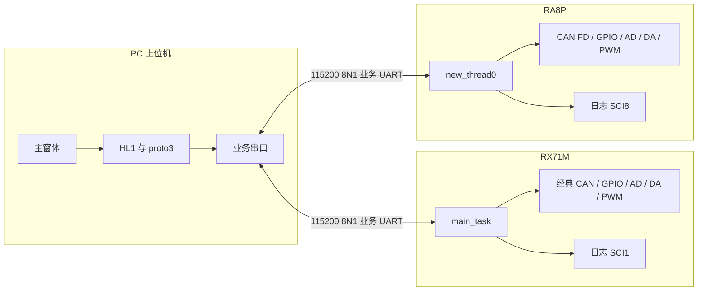
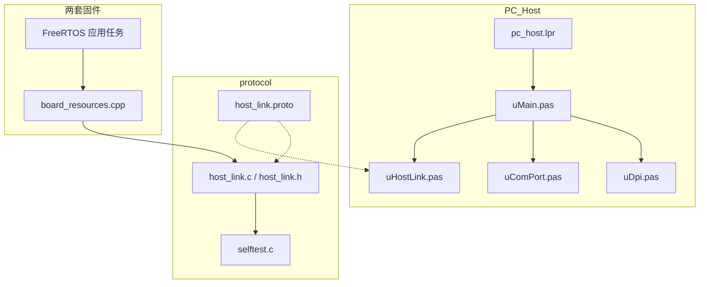
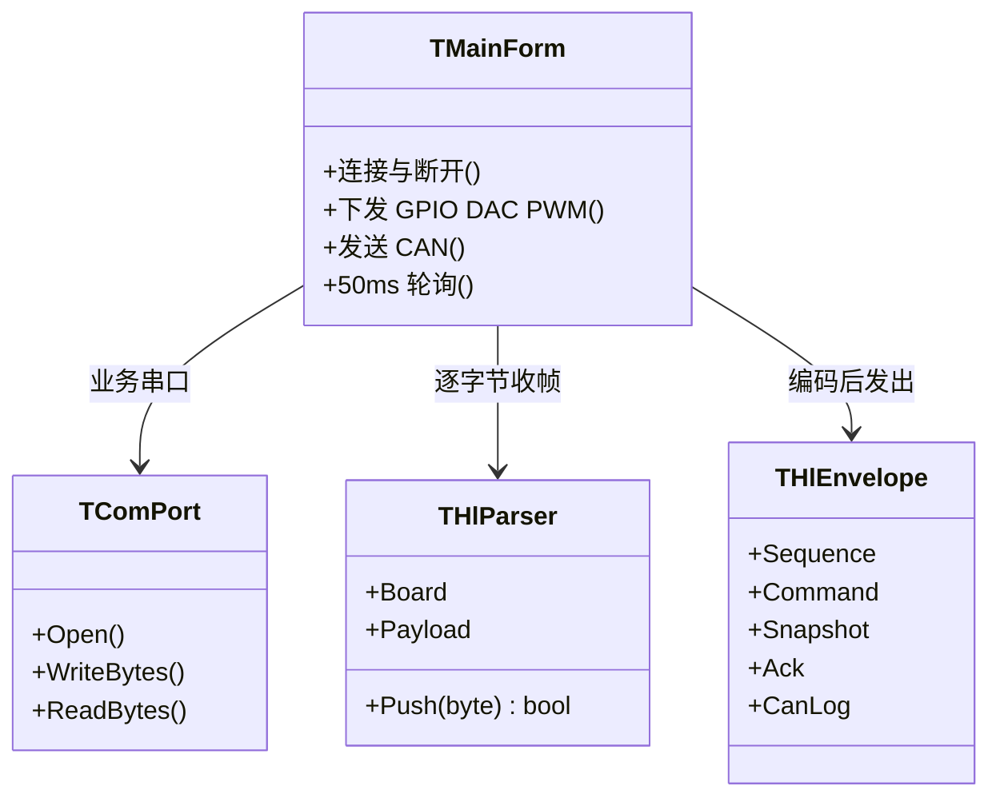
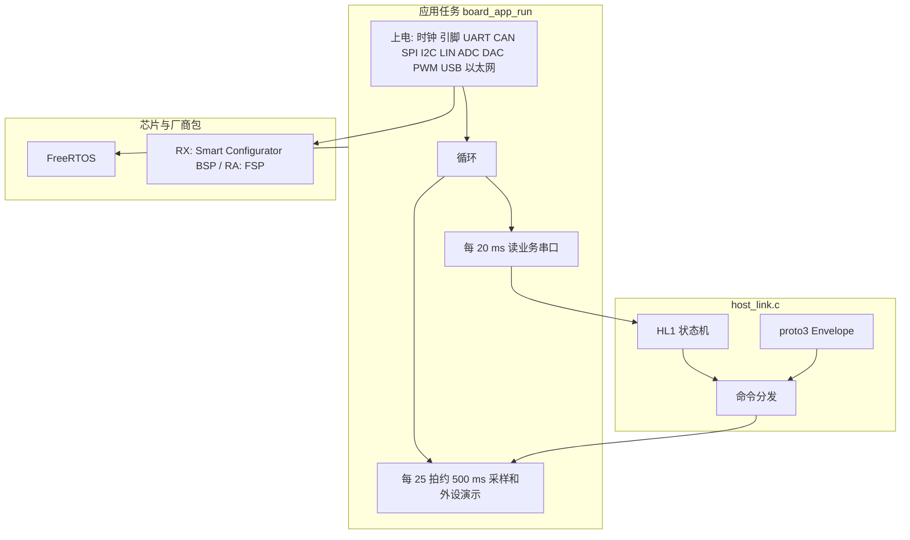
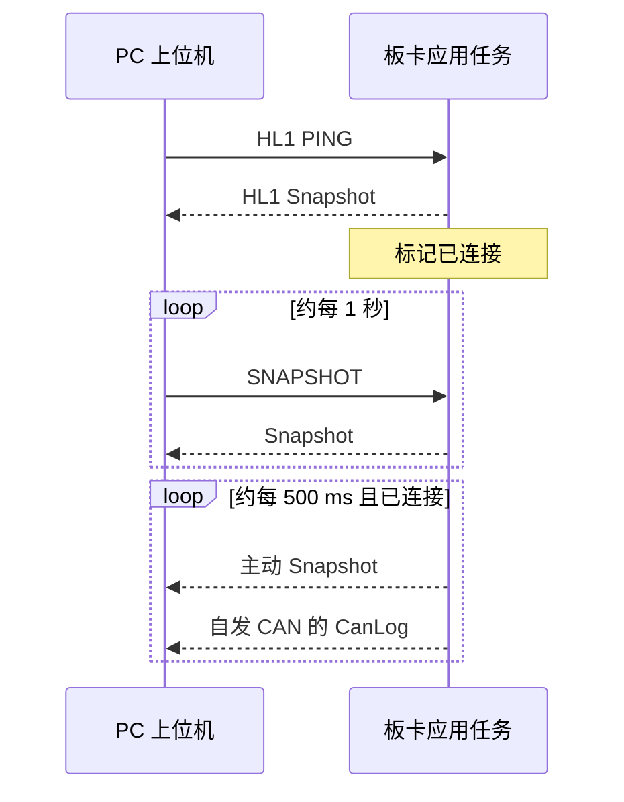
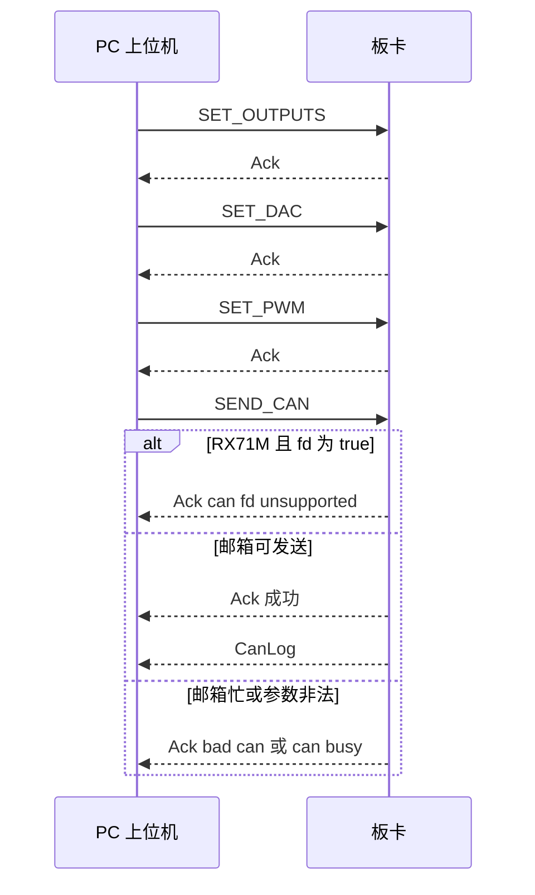
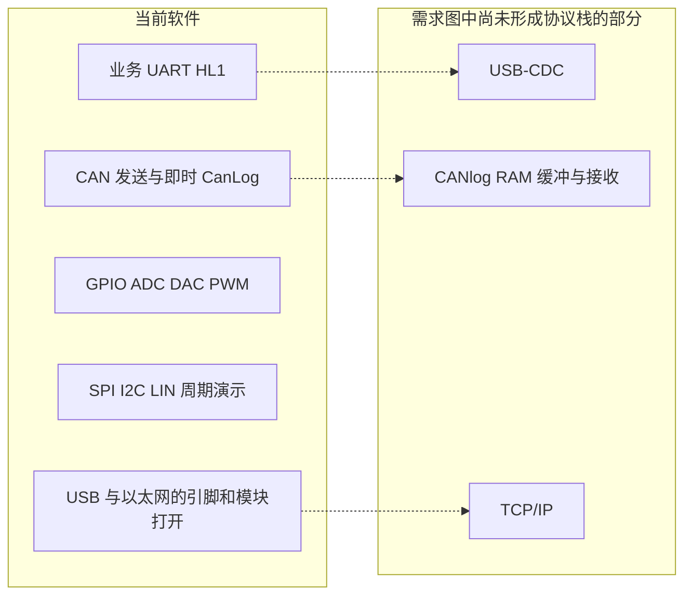

# 系统平台软件结构

本文描述仓库里已经落地的软件，不是委托需求图里的目标形态。范围包括 PC 上位机、共用 HL1 协议，以及 RX71M、RA8P 两套固件。

日文版见 `software_architecture_ja.md`。

协议正文见 `host_link_protocol.md`。引脚对照见 `mcu_resource_map.md`。

## 1. 仓库组成

| 目录 | 角色 |
|---|---|
| `PC_Host` | Lazarus 4.8 / FPC 3.2.2 上位机。窗体、串口、协议编解码 |
| `protocol` | 帧与 proto3 的唯一模式来源。`.proto`、C 实现、C 自检 |
| `POC_RX71M` | RX71M 固件。GCC for Renesas RX，Smart Configurator，FreeRTOS |
| `POC_RA8P` | RA8P 固件。LLVM Arm（ATfE），FSP，FreeRTOS |
| `doc` | 需求、资源表、协议和本文 |

两套固件都不链接 libprotobuf。它们用 `#include "../../../protocol/host_link.c"` 把同一份 C 编进 `board_resources.cpp`。PC 用 Pascal 再实现一遍，启动时用 `HostLinkMatchesProtoc` 对照 protoc 36.2 的黄金字节。

## 2. 运行时上下文

上位机一次打开一个 COM 口，接到一块板的业务串口。日志串口只给人看文本，不进本协议。

同一时刻只接其中一路。帧里的板卡号用来声明目标：0 表示不限，1 是 RX71M，2 是 RA8P。板卡收到不是 0 也不是自己的帧时丢弃，不回答。

## 3. 逻辑结构

PC、共用协议、两套板级程序分成三条实现线，线上格式只有一套。

### 3.1 上位机

| 单元 | 职责 |
|---|---|
| `pc_host.lpr` | 打开 LCL 缩放，创建主窗体 |
| `uMain.pas` | 连接、下发、日志、50 ms 轮询 |
| `uDpi.pas` | 把按 96 PPI 书写的宽度换到当前窗体 |
| `uComPort.pas` | Windows 串口，115200 8N1，立即返回的读 |
| `uHostLink.pas` | 组帧、解帧、proto3 编解码、启动自检 |
| `tools/hl_check.lpr` | 不打开窗体，只跑同一套自检 |

窗体按设计期 PPI 摆放，`Application.Scaled` 打开，Windows 清单为 Per-Monitor V2。状态栏宽度在运行期按 96 PPI 常量重算。

### 3.2 固件共同结构

两块板各有一个应用任务，进入后不再返回。任务内部先做外设上电，然后循环。

| 板 | 任务入口 | 创建位置 | 应用主体 |
|---|---|---|---|
| RX71M | `main_task` | `freertos_user_port.c`，栈深度 512，优先级 3 | `POC_RX71M.c` 调用 `board_app_run()` |
| RA8P | `new_thread0` | `ra_gen/new_thread0.c`，栈 4096 字节 | `new_thread0_entry.cpp` 调用 `board_app_run()` |

`board_resources.cpp` 同时是外设操作和协议回调的所在。回调包括写业务串口、设置 GPIO、DAC、PWM、发送 CAN、填写 Snapshot。

500 ms 节拍在未连接时会改写 GPIO 和 DAC，便于示波器观察。收到第一帧合法请求后停止改写这三项，避免冲掉上位机刚写的值。SPI 交换、I2C 写地址 `0x50`、LIN Break 加 `0x55`、自发 CAN 仍然继续。

### 3.3 两块板的软件差异

帧、命令号、字段号相同。差异在板卡号、CAN 能力和厂商包。

| 项目 | RX71M | RA8P |
|---|---|---|
| 工程 | `POC_RX71M` | `POC_RA8P` |
| 板卡号 / 名字 | 1 / `RX71M` | 2 / `RA8P1` |
| 业务串口 | SCI2 | SCI7 |
| 日志串口 | SCI1 | SCI8 |
| CAN | 经典 CAN，拒绝 `fd=true` | CAN FD，`fd=true` 时置 FD 格式位 |
| 发出帧的 CAN FD 标志 | 不置 | 置位 |
| PWM | MTU3 / MTU4，1 kHz，通道 0–3 | GPT1 / GPT12 / GPT10，1 kHz，通道 0–3 |
| 厂商层 | `smc_gen`、RX GCC FreeRTOS 移植 | `ra/fsp`、`ra_gen`、FSP FreeRTOS 移植 |

PWM 通道号与上位机下拉框一致：0、1、2、3。占空比用千分比，0–1000。

## 4. 连接与命令时序

打开串口后立刻发 PING。之后每 50 ms 读一次；每约 1 秒，未见到应答就再发 PING，见到之后改发 SNAPSHOT。板卡侧每 20 ms 把业务串口里的字节送进解析器。

下发按钮连续发三帧，每帧一个命令。CAN 发送成功时先回 Ack，再单独一帧 CanLog。

序号分成两段。PC 从 1 递增，绕过 0。板卡应答沿用请求里的序号。板卡主动上报从 `0x80000000` 递增。帧头只放低 8 位，完整序号在 protobuf 里。

## 5. 外设在软件中的位置

这些模块都在 `board_resources.cpp` 里直接操作寄存器，没有再套一层独立驱动库。

| 软件模块 | 当前行为 |
|---|---|
| 业务 UART | HL1 帧。RX 为 SCI2，RA 为 SCI7 |
| 日志 UART | 文本行：tick、两路 AD、输入掩码 |
| GPIO | 四路输入、四路输出。输出可由上位机按掩码改写 |
| ADC | 两路采样，放进 Snapshot |
| DAC | 12 位，可由上位机改写 |
| PWM | 四路 1 kHz，占空比按千分比改写 |
| CAN | 两路发送。上位机请求，以及 500 ms 自发经典帧 |
| SPI / I2C / LIN | 500 ms 演示各一次，没有上位机命令 |
| USB | 打开设备时钟并拉起 D+。没有 USB-CDC 类驱动 |
| 以太网 | 引脚、模块复位。RX 另写 MAC 并打开收发使能。没有收发包，也没有 TCP/IP |

CAN 上报是“刚发出的那一帧”立刻用 CanLog 送出。没有接收邮箱，也没有 RAM 环形日志。

## 6. 构建

| 产物 | 工具 | 结果 |
|---|---|---|
| `PC_Host/pc_host.exe` | `lazbuild`，Lazarus 4.8，FPC 3.2.2 | Win64 窗体程序 |
| `PC_Host/tools/hl_check.exe` | 同一 FPC，只链 `uHostLink.pas` | 打印 `ok` 或 `FAIL` |
| `POC_RX71M` Debug / Release | e2 studio 的 GNU make，RX GCC | `.elf` 与 `.mot` |
| `POC_RA8P` Debug / Release | e2 studio 的 GNU make，Arm LLVM | `.elf` 与 `.srec` |
| `protocol/selftest.c` | 主机 C 编译器 | 对照 C 编解码与板卡分发 |

`protocol/host_link.proto` 用 protoc 36.2 生成黄金字节。固件工程不把 protoc 放进链接。

## 7. 和需求图的关系

`embedded_system_requirements.md` 里的目标结构包含 USB、CANlog 的 RAM 缓冲、CAN 协议栈和 Ethernet 通信。当前代码对应关系如下。

已经能从 PC 经业务串口控制两块板的 GPIO、DAC、PWM 和 CAN 发送，并收回状态与发送记录。USB 设备类、以太网报文和 CAN 接收日志还停在模块打开这一层。
