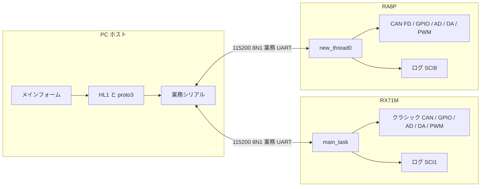
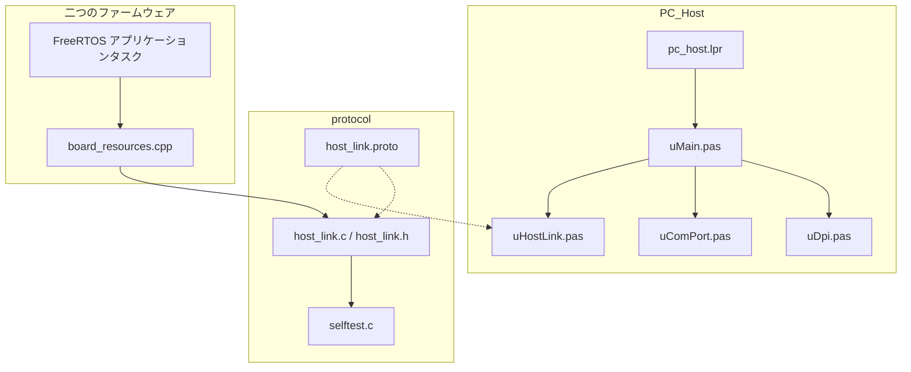
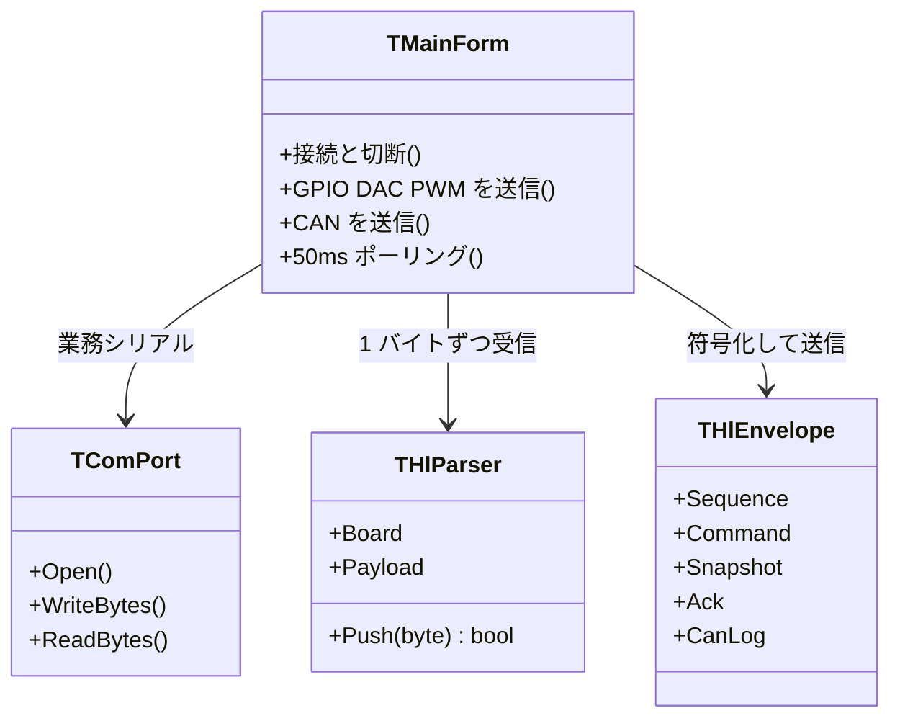
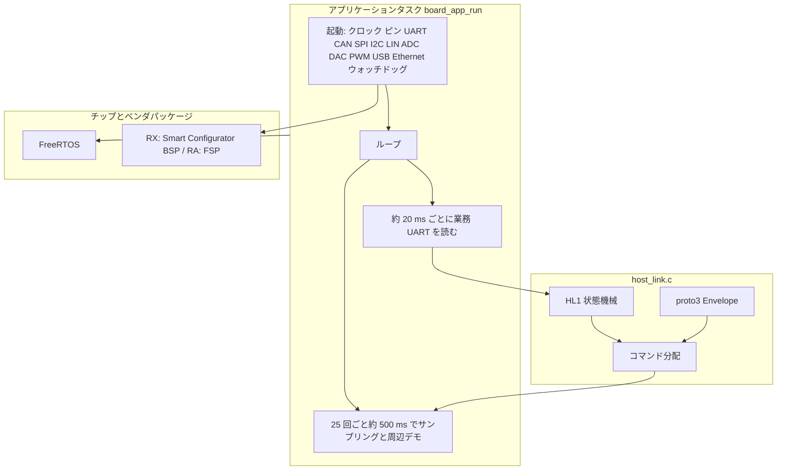
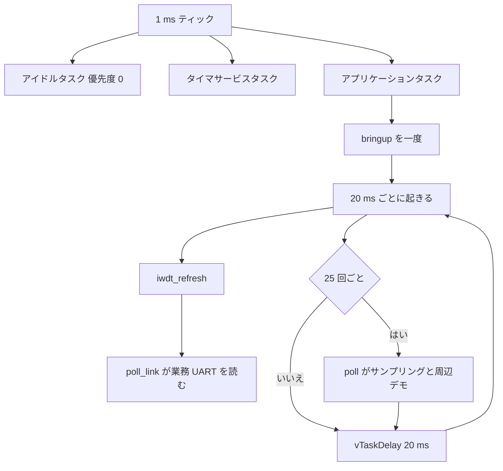
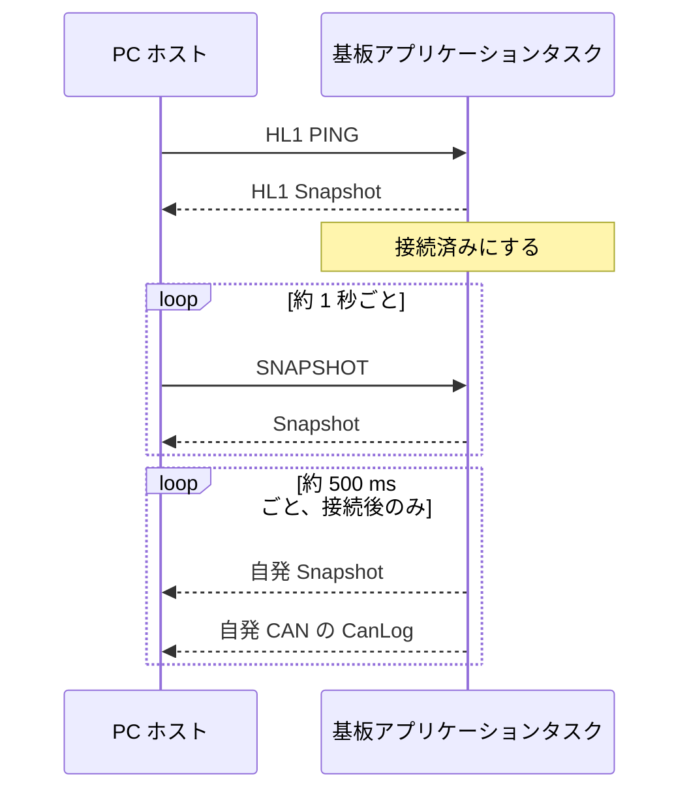
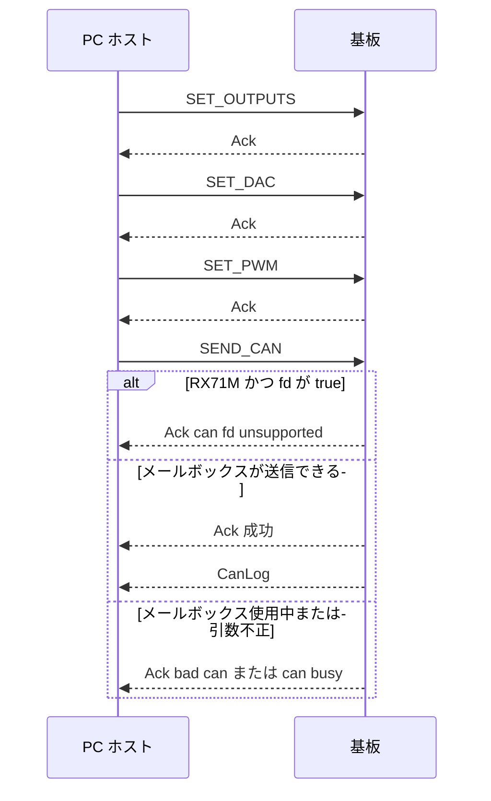
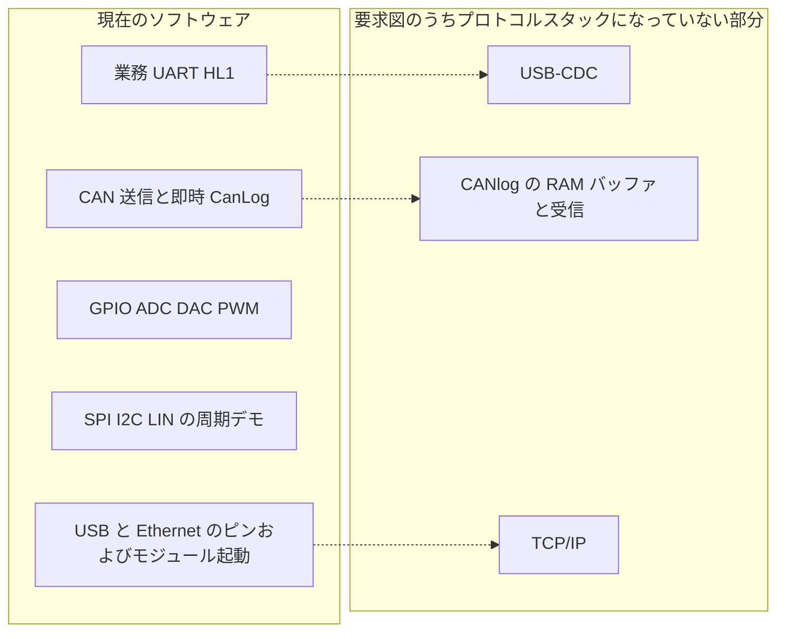

# システムプラットフォームのソフトウェア構成

本文は、リポジトリに実装済みのソフトウェアを説明する。委託要求図の目標形態ではない。範囲は PC ホスト、共通 HL1 プロトコル、RX71M と RA8P の二つのファームウェアである。

日本語版の対になる中国語版は `software_architecture.md` を参照する。

プロトコル本文は `host_link_protocol_ja.md`。ピン対応は `mcu_resource_map.md`。ディレクトリ、メモリ、クロック、使用量は中国語の `workspace_layout.md`。

## 1. リポジトリ構成

| ディレクトリ | 役割 |
|---|---|
| `PC_Host` | Lazarus 4.8 / FPC 3.2.2 のホスト。フォーム、シリアル、プロトコル符号化 |
| `protocol` | フレームと proto3 の唯一の定義。`.proto`、C 実装、C 自己試験 |
| `POC_RX71M` | RX71M ファームウェア。GCC for Renesas RX、Smart Configurator、FreeRTOS |
| `POC_RA8P` | RA8P ファームウェア。LLVM Arm（ATfE）、FSP、FreeRTOS |
| `doc` | 要求、リソース表、プロトコル、本文 |

二つのファームウェアは libprotobuf をリンクしない。`board_link.cpp` が `#include "../../../protocol/host_link.c"` で同じ C をファームウェアに取り込む。PC は Pascal で同じ形式を別実装し、起動時に `HostLinkMatchesProtoc` で protoc 36.2 の基準バイト列と照合する。

## 2. 実行時のコンテキスト

ホストは COM ポートを一度に一つだけ開き、一枚の基板の業務 UART に接続する。ログ用 UART は人が読むテキストだけで、本プロトコルは通さない。

同時に繋ぐのはどちらか一方である。フレーム内の基板番号が宛先を示す。0 は制限なし、1 は RX71M、2 は RA8P。基板は、0 でも自番号でもないフレームを破棄し、応答しない。

## 3. 論理構成

PC、共通プロトコル、二つの基板プログラムは実装が三系統で、回線上の形式は一つである。

### 3.1 ホスト

| ユニット | 役割 |
|---|---|
| `pc_host.lpr` | LCL スケーリングを有効にし、メインフォームを生成する |
| `uMain.pas` | 接続、設定送信、ログ、50 ms 周期のポーリング |
| `uDpi.pas` | 96 PPI 基準の幅を現在のフォームへ換算する |
| `uComPort.pas` | Windows シリアル。115200 8N1。読み出しは即時復帰 |
| `uHostLink.pas` | フレーム組立と分解、proto3 符号化、起動時自己試験 |
| `tools/hl_check.lpr` | フォームを開かず、同じ自己試験だけを実行する |

フォームは設計時 PPI で配置する。`Application.Scaled` は有効、Windows マニフェストは Per-Monitor V2。ステータスバー幅は実行時に 96 PPI の定数から再計算する。

### 3.2 ファームウェアの共通構造

各基板にアプリケーションタスクが一つあり、入ったあと戻らない。タスク内で先に周辺機能を起動し、そのあとループする。

| 基板 | タスク入口 | 生成箇所 | アプリケーション本体 |
|---|---|---|---|
| RX71M | `main_task` | `freertos_user_port.c`。スタック 512 ワード（2048 バイト）、優先度 3 | `POC_RX71M.c` が `board_app_run()` に入り、ループは `board_app.cpp` |
| RA8P | `new_thread0` | `ra_gen/new_thread0.c`。静的スタック 4096 バイト（1024 ワード）、優先度 1 | `new_thread0_entry.cpp` が `board_app_run()` に入り、ループは `board_app.cpp` |

周辺操作とプロトコルコールバックは `src/board/board_*.cpp` に分かれている。コールバックは `board_link.cpp` にあり、業務 UART への書き込み、GPIO、DAC、PWM の設定、CAN 送信、Snapshot の記入を行う。タスクのループは `board_app.cpp` にある。

500 ms 周期は、未接続のあいだ GPIO と DAC を書き換える。オシロスコープで観察するためである。正当な要求を最初に受けたあと、この三つは上書きしない。ホストが書いた値を消さないためである。SPI 交換、I2C のアドレス `0x50` への書き込み、LIN Break と `0x55`、自発 CAN は続ける。

独立ウォッチドッグは `bringup()` の最後で起動する。コードは `board_wdt.cpp`。オプション設定語はリセット後に停止のままなので、起動設定が終わってから計数が始まる。RX の専用クロックは公称 15 kHz、分周 /16、カウント 16384 で、タイムアウトは約 17.5 s。RA では同じ分周が 16384 Hz のもとでちょうど 16 s になる。ウィンドウはカウントの始点から終点までリフレッシュを許す。タスクは 20 ms ごとに先に `iwdt_refresh()` を呼ぶ。順序は `0x00` のあと `0xFF`。アンダーフローはチップをリセットする。もう一つの WDT は起動しない。

### 3.3 二つの基板のソフトウェア差分

フレーム、コマンド番号、フィールド番号は同じである。違いは基板番号、CAN の能力、ベンダパッケージである。

| 項目 | RX71M | RA8P |
|---|---|---|
| プロジェクト | `POC_RX71M` | `POC_RA8P` |
| 基板番号 / 名前 | 1 / `RX71M` | 2 / `RA8P1` |
| 業務 UART | SCI2 | SCI7 |
| ログ UART | SCI1 | SCI8 |
| CAN | クラシック CAN。`fd=true` は拒否 | CAN FD。`fd=true` のとき FD 形式ビットを立てる |
| 送信フレームの CAN FD フラグ | 立てない | 立てる |
| PWM | MTU3 / MTU4、1 kHz、チャネル 0–3 | GPT1 / GPT12 / GPT10、1 kHz、チャネル 0–3 |
| ベンダ層 | `smc_gen`、RX GCC の FreeRTOS 移植 | `ra/fsp`、`ra_gen`、FSP の FreeRTOS 移植 |

PWM チャネル番号はホストの選択と一致する。0、1、2、3。デューティはパーミルで、0–1000。

### 3.4 FreeRTOS の設定

両基板ともプリエンプティブで、ティックは 1 ms である。アプリケーションタスクは一つだけである。プロトコルはそのタスクがポーリングする。UART を割り込みで受信せず、キュー、セマフォ、ソフトウェアタイマも自作していない。カーネルのアイドルタスクとタイマサービスタスクは存在する。

| 項目 | RX71M | RA8P |
|---|---|---|
| 設定ファイル | `src/frtos_config/FreeRTOSConfig.h` | `ra_cfg/aws/FreeRTOSConfig.h` |
| 移植 | GCC RX600v2 の `port.c` | FSP の `rm_freertos_port` |
| ティック | 1000 Hz。CMT0。PCLKB を 8 分周し、比較値は `BSP_PCLKB_HZ / 1000 / 8 - 1`。基板側は PCLKB を 60 MHz として扱う | 1000 Hz。FSP の移植が SysTick を使い、クロックは `SystemCoreClock` |
| スケジューリング | プリエンプティブ。同一優先度のタイムスライスは有効 | プリエンプティブ。同一優先度のタイムスライスは無効 |
| 優先度数 | 7（0 が最低、6 が最高） | 5（0 が最低、4 が最高） |
| カーネル割り込み | ティック優先度 `configKERNEL_INTERRUPT_PRIORITY = 1`。FreeRTOS API を呼べるのは優先度の数値が 4 以上の割り込み。0 が最高なので、0 から 3 は呼べない | `configLIBRARY_MAX_SYSCALL_INTERRUPT_PRIORITY = 1` |
| ヒープ | `heap_4.c`。動的割り当て。合計 8 KiB | 静的割り当てだけ。`configTOTAL_HEAP_SIZE` は 1024 バイト。アプリケーションタスクのスタックはここから取らない |
| アイドルタスクのスタック | 140 ワード（560 バイト） | 128 ワード（512 バイト）。メモリは `ra_gen/main.c` が渡す |
| タイマサービスタスク | 優先度 6、スタック 140 ワード、コマンドキュー長 5。アプリケーションはソフトウェアタイマを作っていない | 優先度 3、スタック 128 ワード、コマンドキュー長 10。アプリケーションはソフトウェアタイマを作っていない |
| フック | アイドルとティックのフックは空。ヒープ確保失敗とスタックオーバーフロー（検査レベル 2）は割り込みを止めてループする | アイドルフックだけ有効。ティックフック、ヒープ失敗フックはなく、スタック検査は閉じている |
| 浮動小数点コンテキスト | `configUSE_TASK_DPFPU_SUPPORT = 0` | FSP ポートの既定 |

ミューテックス、再帰ミューテックス、計数セマフォ、イベントグループ、ストリームバッファは RX の設定では有効だが、`Kernel_Object_init()` は空で、アプリケーションはこれらを作っていない。RA は計数セマフォを有効にし、ミューテックスは無効。アプリケーションもカーネルオブジェクトを作っていない。

### 3.5 タスク設計

起動後、カーネルに常駐するのはアイドルタスク、タイマサービスタスク、そして次のアプリケーションタスク一つである。二つ目のアプリケーションタスクはない。

| 項目 | RX71M `MAIN_TASK` | RA8P `New Thread` |
|---|---|---|
| 生成 | `Processing_Before_Start_Kernel()` で `xTaskCreate`。失敗すると空ループに留まる | `main()` が `new_thread0_create()` を呼び、`xTaskCreateStatic`。失敗は `rtos_startup_err_callback` |
| 優先度 | 3。タイマサービス 6 より低く、アイドル 0 より高い | 1。タイマサービス 3 より低く、アイドル 0 より高い |
| スタック | 512 ワード。8 KiB ヒープから。約 2048 バイト | 4096 バイトの静的配列。1024 ワードとしてカーネルへ渡す |
| 入口 | `main_task` が `board_app_run()` を呼ぶ。通常は戻らない | `new_thread0_func` が FSP の共通初期化のあと `new_thread0_entry()` を呼び、`board_app_run()` に入る |
| ループ | 先に `bringup()`、最後に `iwdt_open()`。その後 20 ms ごとに先に `iwdt_refresh()`、続いて `poll_link()`。25 回ごと、約 500 ms で `poll()` | RX と同じ |

`vTaskDelay(pdMS_TO_TICKS(20))` は 1000 Hz では 20 ティックである。待っているあいだ CPU はアイドルタスクへ渡る。シリアルのコマンドはおよそ 20 ms 以内に見られ、周辺デモと周期通知はおよそ 500 ms に一度である。

このタスクはキューを作らない。CAN も UART も割り込みコールバックには置かない。プロトコルのバイトは `poll_link()` が読んで `hl_board_push()` へ渡す。

## 4. 接続とコマンドの時系列

ポートを開いた直後に PING を送る。その後は 50 ms ごとに読む。約 1 秒ごとに、応答がなければ PING を再送し、応答があれば SNAPSHOT に切り替える。基板は 20 ms ごとに業務 UART のバイトをパーサへ渡す。

設定ボタンはフレームを三つ連続して送る。一フレームにコマンドは一つ。CAN 送信が成功したときは、先に Ack を返し、続けて別フレームで CanLog を送る。

シーケンスは二つに分ける。PC は 1 から増加し、0 は使わない。基板の応答は要求の sequence を返す。基板の自発通知は `0x80000000` から増加する。フレームヘッダには下位 8 ビットだけを入れ、完全な番号は protobuf に置く。

## 5. 周辺機能のソフトウェア上の位置

これらのモジュールは周辺機能ごとに `src/board/board_*.cpp` へ分かれ、レジスタを直接操作する。独立したドライバライブラリは挟まない。

| ソフトウェアモジュール | 現在の動作 |
|---|---|
| 業務 UART | HL1 フレーム。RX は SCI2、RA は SCI7 |
| ログ UART | テキスト行。tick、AD 二系統、入力マスク |
| GPIO | 入力 4 本、出力 4 本。出力はホストがマスクで書き換える |
| ADC | 二系統をサンプリングし、Snapshot に入れる |
| DAC | 12 ビット。ホストが書き換えられる |
| PWM | 4 チャネル、1 kHz。デューティはパーミルで書き換える |
| CAN | 二系統の送信。ホスト要求と、500 ms の自発クラシックフレーム |
| SPI / I2C / LIN | 500 ms ごとに各一回のデモ。ホストコマンドはない |
| USB | デバイスクロックを入れ、D+ を引き上げる。USB-CDC クラスドライバはない |
| Ethernet | ピンとモジュールリセット。RX は MAC を書き、送受信イネーブルも立てる。パケットも TCP/IP もない |
| 独立ウォッチドッグ | `board_wdt.cpp`。起動完了後に開始。タスクが 20 ms ごとにリフレッシュ。RX は約 17.5 s、RA は 16 s。WDT は起動しない |

CAN の通知は、送り終わったフレームを直ちに CanLog で出す。受信メールボックスも、RAM のリングログもない。

## 6. ビルド

| 成果物 | ツール | 結果 |
|---|---|---|
| `PC_Host/pc_host.exe` | `lazbuild`、Lazarus 4.8、FPC 3.2.2 | Win64 のフォームプログラム |
| `PC_Host/tools/hl_check.exe` | 同じ FPC。`uHostLink.pas` のみリンク | `ok` または `FAIL` を表示 |
| `POC_RX71M` Debug / Release | e2 studio の GNU make、RX GCC | `.elf` と `.mot` |
| `POC_RA8P` Debug / Release | e2 studio の GNU make、Arm LLVM | `.elf` と `.srec` |
| `protocol/selftest.c` | ホストの C コンパイラ | C の符号化と基板側分配を照合 |

`protocol/host_link.proto` は protoc 36.2 で基準バイト列を作る。ファームウェアのリンクには protoc を入れない。

## 7. 要求図との関係

`embedded_system_requirements_ja.md` の目標構成には、USB、CANlog の RAM バッファ、CAN プロトコルスタック、Ethernet 通信が含まれる。現在のコードとの対応は次のとおりである。

PC から業務 UART で、二つの基板の GPIO、DAC、PWM、CAN 送信を操作し、状態と送信記録を受け取れる。USB デバイスクラス、Ethernet パケット、CAN 受信ログは、モジュールを開いた層で止まっている。
