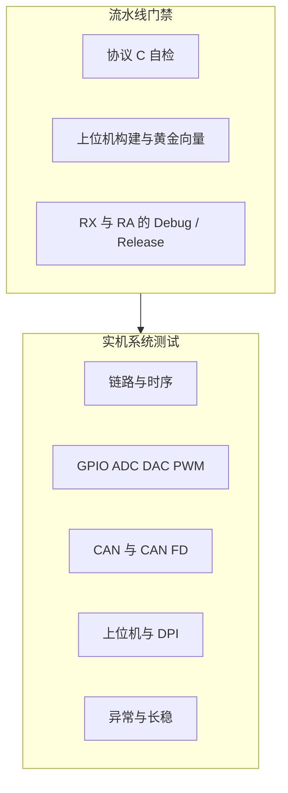
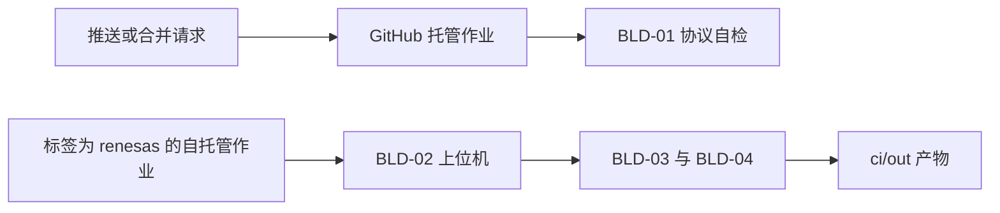

# 系统测试设计

本文是当前已实现软件的系统测试设计，并给出一轮测试的工数。范围是 PC 上位机、HL1 协议，以及 RX71M、RA8P 两套固件。结构说明见 `software_architecture.md`，协议见 `host_link_protocol.md`。

日文版见 `system_test_design_ja.md`。

工数口径：1 人日 = 8 小时，1 人月 = 20 人日。数字是一名熟悉本仓库的工程师完成一轮的估算，含准备、执行和记录，不含需求变更后的新功能开发。

## 1. 测试目标和通过准则

确认上位机能经业务串口控制两块板的 GPIO、DAC、PWM 和 CAN 发送，并收回 Snapshot 与 CanLog。构建门禁要求协议自检、上位机黄金向量、两套固件的 Debug 与 Release 都能生成约定产物。

一轮通过的条件：

- `ci/pipeline.ps1` 的 protocol、host、firmware 三段都为 PASS。
- 下表里优先级为 P1 的实机用例在 RX71M 和 RA8P 上各执行一次，失败项有记录。
- 已知不做的 USB 设备类、以太网报文、CAN 接收日志，不作为本轮失败项。



## 2. 工数汇总

| 工作包 | 人日 | 内容 |
|---|---:|---|
| 环境与夹具 | 3.0 | 两块板、业务串口、日志口、示波器或逻辑分析仪、CAN 工具、接线核对 |
| 构建门禁首轮核对 | 1.5 | 跑通流水线，核对 0 错误，留下产物和告警记录 |
| 链路与时序 | 2.0 | 16 小时，见第 5 节 |
| GPIO / ADC / DAC / PWM | 3.0 | 24 小时 |
| CAN / CAN FD | 2.5 | 20 小时 |
| 上位机与 DPI | 1.0 | 8 小时 |
| 异常与恢复 | 1.5 | 12 小时 |
| 长稳 | 1.0 | 连续 8 小时，人守在开始、抽查和结束 |
| 记录与缺陷回归余量 | 3.0 | 按一轮发现缺陷后再测，约 20% |
| 合计 | 18.5 | 148 小时，约 0.93 人月 |

流水线脚本和 GitHub Actions 已随本文交付，不重复计入上表。若以后补上 USB 设备类、以太网收发包或 CAN 接收环形日志，另加约 10 人日的第二轮，不在本轮里。

## 3. 环境

| 物品 | 用途 |
|---|---|
| 安装了 Lazarus 4.8、Visual Studio 2022 C++、e2 studio 与两套编译器的 Windows PC | 跑 `ci/pipeline.ps1`，并作为上位机 |
| RX71M、RA8P 各一块，已烧录本仓库对应固件 | 实机 |
| 两路 USB 转串口 | 一路接业务口，一路接日志口。测一块板时接这一块 |
| 示波器或逻辑分析仪 | PWM、DAC、GPIO、LIN Break |
| CAN 分析仪，能看经典帧；RA 还需能看 CAN FD | 核对 `0x123`、`0x321` 和上位机发出的帧 |
| 可拨动的四路输入 | 改变 Snapshot.inputs |

业务口 115200 8N1，交叉连接并共地。日志口只看文本，不作为协议通过依据。一次只接一块板的业务口。

## 4. 构建门禁

这些用例由 `ci/pipeline.ps1` 执行。优先级都是 P1。

| 编号 | 步骤与期望 | 工时 |
|---|---|---:|
| BLD-01 | 用 Visual C++ 编译 `protocol/host_link.c` 与 `selftest.c` 并运行。进程退出码 0，输出里没有 `FAIL`。 | 2 h |
| BLD-02 | `lazbuild` 生成 `pc_host.exe`。再用 FPC 编译 `hl_check.lpr`，输出 `ok`。 | 2 h |
| BLD-03 | RX71M Debug、Release 生成 `POC_RX71M.elf` 与 `.mot`。make 退出码 0。 | 4 h |
| BLD-04 | RA8P Debug、Release 生成 `POC_RA8P.elf` 与 `.srec`。make 退出码 0。 | 4 h |

首轮含工具路径核对，所以这四项合计 12 小时，即 1.5 人日。之后每次回归只重跑流水线，不再按这个工时重复估算。

## 5. 链路与时序

每条都在两块板上做，工时已含两块板。除另有说明，业务口抓包或上位机日志作为证据。

| 编号 | 优先级 | 操作与期望 | 自动化 | 工时 |
|---|---|---|---|---:|
| LNK-01 | P1 | 打开正确 COM，选自动。1 秒内日志出现 Snapshot，状态栏变为已连接。板卡号与名字符合该板。 | 实机 | 3 h |
| LNK-02 | P1 | 打开空口或不接板。约 2 秒出现“没有应答”提示，并继续 PING。 | 实机 | 1 h |
| LNK-03 | P1 | 上位机选 RX，只接 RA。RA 不回答。改选自动或 RA 后恢复。反向再做一次。 | 实机 | 2 h |
| LNK-04 | P1 | 向业务口写入魔数正确、CRC 错误的帧。板卡不置已连接，不回二进制。日志口仍可有文本。 | 实机 | 2 h |
| LNK-05 | P1 | 上电后、收到合法帧之前，业务口没有 HL1 帧。日志口可以有 `resources up` 和周期文本。 | 实机 | 2 h |
| LNK-06 | P1 | 连接后用上位机把 GPIO、DAC、PWM 设成固定值。再等两个 500 ms 周期，这三项不被演示循环改掉。ADC、输入和自发 CAN 仍在变。 | 实机 | 3 h |
| LNK-07 | P2 | 应答帧的 protobuf sequence 等于请求。主动 Snapshot 与 CanLog 的 sequence 不小于 `0x80000000`。帧头序号等于其低 8 位。 | 实机 | 2 h |
| LNK-08 | P1 | 连接后点断开，再连同一 COM。序号从 1 重新开始，解析器不吃进半帧。 | 实机 | 1 h |

小计 16 小时，2.0 人日。

## 6. GPIO、ADC、DAC、PWM

下发按钮一次送出 SET_OUTPUTS、SET_DAC、SET_PWM 三帧。测单项时，其余输入填合法值。示波器或万用表核对引脚，引脚表见 `mcu_resource_map.md`。

| 编号 | 优先级 | 操作与期望 | 工时 |
|---|---|---|---:|
| IO-01 | P1 | 掩码 0。四路输出为低。Ack 成功。随后 Snapshot 的 outputs 为 0。 | 2 h |
| IO-02 | P1 | 掩码 15。四路输出为高。Snapshot 低 4 位为 15。 | 1 h |
| IO-03 | P1 | 掩码 16。上位机拒绝发送。若绕过界面送出，板卡 Ack 为 `bad outputs`。 | 1 h |
| IO-04 | P1 | DAC 取 0、2048、4095。Ack 成功。输出电压随码单调变化，Snapshot.dac 与下发值一致。 | 4 h |
| IO-05 | P1 | DAC 填 4096。上位机拒绝。绕过时 Ack 为 `bad dac`。 | 1 h |
| IO-06 | P1 | 通道 0–3，占空比 0、500、1000。Ack 成功。1 kHz 波形的高电平比例与千分比相符，1000 不超出周期。 | 8 h |
| IO-07 | P1 | 占空比 1001，或通道号大于 3。Ack 为 `bad pwm`，原波形不变。 | 1 h |
| IO-08 | P1 | 拨动四路输入。下一份 Snapshot 的 inputs bit0–bit3 与电平一致。 | 3 h |
| IO-09 | P2 | 改变两路模拟输入。adc0、adc1 随输入变化，日志行与 Snapshot 同一量级。 | 3 h |

小计 24 小时，3.0 人日。

## 7. CAN 与 CAN FD

自发帧是经典 CAN，1 字节，标识符 `0x123` 与 `0x321`，约 500 ms。上位机请求使用 11 位 ID，数据 1–8 字节。

| 编号 | 优先级 | 操作与期望 | 工时 |
|---|---|---|---:|
| CAN-01 | P1 | 通道 0，经典帧，ID `0x123`，数据 `11`。Ack 成功，随后单独一帧 CanLog。分析仪看到该帧。 | 3 h |
| CAN-02 | P1 | 通道 1 重复 CAN-01。两路都能发出。 | 2 h |
| CAN-03 | P1 | 只接 RX，勾选 CAN FD。Ack 状态为不支持，detail 为 `can fd unsupported`。总线上没有这帧。 | 2 h |
| CAN-04 | P1 | 只接 RA，勾选 CAN FD。Ack 成功，CanLog 的 fd 为真。分析仪按 CAN FD 看到该帧。 | 3 h |
| CAN-05 | P1 | ID 大于 `0x7FF`。上位机拒绝。绕过时 Ack 为 `bad can`。 | 1 h |
| CAN-06 | P1 | 数据为空。上位机拒绝。绕过时 Ack 为 `bad can`。 | 1 h |
| CAN-07 | P1 | 数据 9 字节。上位机拒绝。协议层把超过 8 字节的 Envelope 视为非法。 | 1 h |
| CAN-08 | P1 | 已连接后等待约 1 秒。日志里出现自发 CanLog，分析仪上是经典帧，不是 FD。 | 3 h |
| CAN-09 | P1 | 一次成功的 SEND_CAN：先看到 Ack，再看到 CanLog。两帧序号不同。 | 2 h |
| CAN-10 | P2 | 在邮箱仍忙时连续请求。允许出现 `can busy`，总线不出现半帧。 | 2 h |

小计 20 小时，2.5 人日。

## 8. 上位机与异常

| 编号 | 优先级 | 操作与期望 | 工时 |
|---|---|---|---:|
| PC-01 | P1 | Windows 缩放 100% 与 150% 各打开一次主窗体。命令区可滚动，状态栏三格不被裁掉，自检文字出现。 | 4 h |
| PC-02 | P2 | 刷新串口后，列表按 COM 编号排序，并尽量留在原来的口。 | 1 h |
| PC-03 | P1 | 点下发，抓包顺序为 SET_OUTPUTS、SET_DAC、SET_PWM，每帧一个命令。 | 2 h |
| PC-04 | P2 | 日志超过 400 行后，最旧的一行被删掉，视图停在末尾。 | 1 h |
| NEG-01 | P1 | 送入未定义命令号。Ack 为 `unknown command`。 | 2 h |
| NEG-02 | P1 | 帧 CRC 正确、载荷不是 Envelope。Ack 为 `bad protobuf`。 | 3 h |
| NEG-03 | P1 | 板卡号填对方的编号。本板不回答，连接标志保持原状。 | 2 h |
| NEG-04 | P1 | 通信中拔掉 USB 转串口。上位机记录发送失败并回到未连接，再次插入后能重新 PING。 | 3 h |
| NEG-05 | P2 | 把主机序号推到回绕。回绕后跳过 0，从 1 继续。 | 2 h |
| STB-01 | P2 | 已连接保持 8 小时。期间 Snapshot 仍约 1 秒一次，业务口不出现 CRC 失败风暴，演示循环不改写已下发的 GPIO、DAC、PWM。 | 8 h |

PC 与 NEG 合计 20 小时，其中第 8 节表格前四项加 NEG 为上位机 1.0 人日、异常 1.5 人日。STB-01 单独计 1.0 人日。

## 9. 记录

每条 P1 失败至少留下：板卡、固件是 Debug 还是 Release、上位机日志、业务口十六进制、期望与实际。CAN 用例另附分析仪截图或导出。PWM 和 DAC 记下测量值。

回归只重跑失败项及其相邻用例。余量 3.0 人日用在这上面。若 P1 失败超过 8 条，本轮工数不够，需要另估。

## 10. CI/CD 怎样执行门禁

流水线入口是仓库根目录下的：

```text
powershell -File ci\pipeline.ps1 -Stage all
```

三段可以分开跑：`protocol`、`host`、`firmware`。固件配置默认 Debug 和 Release 都编，只要其中一种时加 `-Configuration Debug` 或 `Release`。



| 工作流 | 何时跑 | 跑什么 |
|---|---|---|
| `.github/workflows/ci.yml` | 每次推送和合并请求 | 只跑 protocol。GitHub 托管的 Windows 运行器有 Visual C++，没有瑞萨编译器 |
| `.github/workflows/firmware.yml` | 推送到 `pcsoft`、`main`、`master`，或手工触发 | 在标签为 `renesas` 的自托管 Windows 运行器上跑全部三段 |
| `.github/workflows/release.yml` | 推送 `v*` 标签 | 同样在自托管运行器上打包 `ci/out`，保留 90 天 |

固件 makefile 由 e2 studio 生成，里面写了本机绝对路径，并且没有纳入 Git。自托管运行器的检出目录必须和生成 makefile 时的仓库路径一致，否则 `pipeline.ps1` 会失败并要求重新生成。合并请求不在自托管运行器上构建，避免执行不可信代码。

本机工具约定：

| 变量 | 未设置时的位置 |
|---|---|
| `LAZBUILD` | `E:\lazarus\lazbuild.exe` |
| `FPC` | Lazarus 自带的 FPC 3.2.2 |
| `RENESAS_MAKE` | e2 studio 插件里的 GNU make。不用 Embarcadero make |

产物放在 `ci/out`：协议自检程序、`hl_check.exe`、两套固件的 elf 与 mot 或 srec，以及 `summary.txt`。该目录被 Git 忽略。

登记自托管运行器时，给它加上标签 `renesas`。运行器尚未登记时，托管作业仍能挡住协议回退；固件和上位机在本机执行 `ci\pipeline.ps1 -Stage all`。
