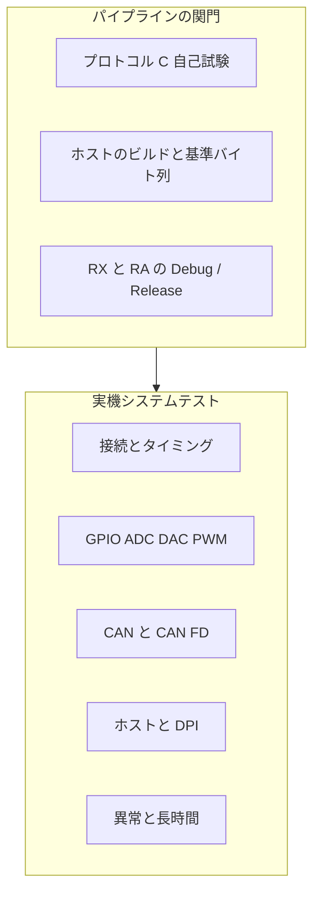
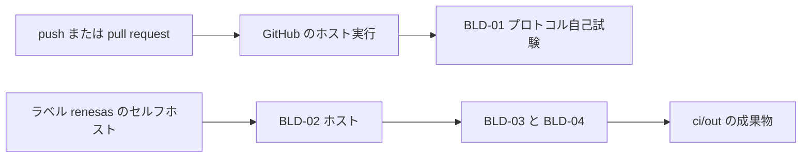

# システムテスト設計

本文は、実装済みソフトウェアのシステムテスト設計であり、一回の試験工数を示す。範囲は PC ホスト、HL1 プロトコル、RX71M と RA8P の二つのファームウェアである。構成は `software_architecture_ja.md`、プロトコルは `host_link_protocol_ja.md` を参照する。

中国語版は `system_test_design.md` を参照する。

工数の単位は、1 人日 = 8 時間、1 人月 = 20 人日である。数値は、このリポジトリに慣れた技術者一名が一回を終える見積もりであり、準備、実施、記録を含む。要求変更に伴う新機能の開発は含まない。

## 1. 試験の目的と合格条件

ホストが業務 UART 経由で、二つの基板の GPIO、DAC、PWM、CAN 送信を操作し、Snapshot と CanLog を受け取れることを確認する。ビルドの関門は、プロトコル自己試験、ホストの基準バイト列、二つのファームウェアの Debug と Release が、定めた成果物を出すことである。

一回を合格とする条件：

- `ci/pipeline.ps1` の protocol、host、firmware がすべて PASS である。
- 下表で優先度 P1 の実機項目を、RX71M と RA8P で各一回実施し、失敗は記録されている。
- 未実装の USB デバイスクラス、Ethernet パケット、CAN 受信ログは、この回の不合格項目にしない。



## 2. 工数の合計

| 作業 | 人日 | 内容 |
|---|---:|---|
| 環境と治具 | 3.0 | 基板二枚、業務 UART、ログ UART、オシロスコープまたはロジックアナライザ、CAN ツール、配線確認 |
| ビルド関門の初回確認 | 1.5 | パイプラインを通し、エラー 0 を確認し、成果物と警告の記録を残す |
| 接続とタイミング | 2.0 | 16 時間。第 5 節 |
| GPIO / ADC / DAC / PWM | 3.0 | 24 時間 |
| CAN / CAN FD | 2.5 | 20 時間 |
| ホストと DPI | 1.0 | 8 時間 |
| 異常と復旧 | 1.5 | 12 時間 |
| 長時間 | 1.0 | 連続 8 時間。開始、抜き取り、終了に人が付く |
| 記録と不具合再試験の余裕 | 3.0 | 一回で出た不具合の再試験。約 20% |
| 合計 | 18.5 | 148 時間。約 0.93 人月 |

パイプラインと GitHub Actions は本文と同時に入っているため、上表には再度入れない。後から USB デバイスクラス、Ethernet の送受信、CAN 受信リングログを足す場合は、第二回として約 10 人日を別計上する。この回には入れない。

## 3. 環境

| 物品 | 用途 |
|---|---|
| Lazarus 4.8、Visual Studio 2022 C++、e2 studio と二つのコンパイラを入れた Windows PC | `ci/pipeline.ps1` とホスト |
| このリポジトリのファームウェアを書き込んだ RX71M と RA8P 各一枚 | 実機 |
| USB シリアル二系統 | 一つは業務、一つはログ。試験中の基板に接続する |
| オシロスコープまたはロジックアナライザ | PWM、DAC、GPIO、LIN Break |
| CAN アナライザ。クラシックフレームが見えること。RA では CAN FD も見えること | `0x123`、`0x321` とホスト送信の確認 |
| 操作できる入力四本 | Snapshot.inputs を変える |

業務口は 115200 8N1、クロス接続、GND 共通。ログ口のテキストは、プロトコル合格の根拠にしない。業務口は一度に一枚だけ接続する。

## 4. ビルドの関門

これらは `ci/pipeline.ps1` が実行する。優先度はすべて P1。

| 番号 | 手順と期待 | 工数 |
|---|---|---:|
| BLD-01 | Visual C++ で `protocol/host_link.c` と `selftest.c` をコンパイルして実行する。終了コード 0。出力に `FAIL` がない。 | 2 h |
| BLD-02 | `lazbuild` で `pc_host.exe` を作る。FPC で `hl_check.lpr` をコンパイルし、`ok` と出る。 | 2 h |
| BLD-03 | RX71M の Debug と Release で `POC_RX71M.elf` と `.mot` ができる。make の終了コードは 0。 | 4 h |
| BLD-04 | RA8P の Debug と Release で `POC_RA8P.elf` と `.srec` ができる。make の終了コードは 0。 | 4 h |

初回はツールパスの確認を含むため、四項目で 12 時間、1.5 人日である。以後の回帰はパイプラインを再実行するだけで、この工数を繰り返して積まない。

## 5. 接続とタイミング

各項目は二つの基板で行う。工数は両方を含む。特記がない限り、業務口のキャプチャまたはホストのログを証跡とする。

| 番号 | 優先度 | 操作と期待 | 自動化 | 工数 |
|---|---|---|---|---:|
| LNK-01 | P1 | 正しい COM を開き、自動を選ぶ。1 秒以内にログへ Snapshot が出て、ステータスが接続済みになる。基板番号と名前がその基板と一致する。 | 実機 | 3 h |
| LNK-02 | P1 | 空のポート、または基板なしで開く。約 2 秒で無応答の案内が出て、PING は続く。 | 実機 | 1 h |
| LNK-03 | P1 | ホストで RX を選び、RA だけ接続する。RA は応答しない。自動または RA に変えると回復する。逆も行う。 | 実機 | 2 h |
| LNK-04 | P1 | マジックは正しく CRC が違うフレームを業務口へ書く。基板は接続済みにせず、バイナリを返さない。ログ口のテキストはあってよい。 | 実機 | 2 h |
| LNK-05 | P1 | 電源投入後、正当なフレームを受けるまで、業務口に HL1 フレームはない。ログ口には `resources up` と周期テキストがあってよい。 | 実機 | 2 h |
| LNK-06 | P1 | 接続後、GPIO、DAC、PWM を固定値にする。500 ms 周期を二つ待っても、デモ循環はこの三つを上書きしない。AD、入力、自発 CAN は変わる。 | 実機 | 3 h |
| LNK-07 | P2 | 応答の protobuf sequence は要求と等しい。自発 Snapshot と CanLog の sequence は `0x80000000` 以上。フレームヘッダの番号はその下位 8 ビットである。 | 実機 | 2 h |
| LNK-08 | P1 | 接続後に切断し、同じ COM を開き直す。sequence は 1 から再開し、パーサは半端なフレームを消費しない。 | 実機 | 1 h |

小計 16 時間、2.0 人日。

## 6. GPIO、ADC、DAC、PWM

設定ボタンは SET_OUTPUTS、SET_DAC、SET_PWM を一フレームずつ送る。単項目を試すとき、他の入力は正当な値にする。ピンはオシロスコープまたはテスタで見る。ピン表は `mcu_resource_map.md`。

| 番号 | 優先度 | 操作と期待 | 工数 |
|---|---|---|---:|
| IO-01 | P1 | マスク 0。出力四本が Low。Ack は成功。その後の Snapshot の outputs は 0。 | 2 h |
| IO-02 | P1 | マスク 15。出力四本が High。Snapshot の下位 4 ビットは 15。 | 1 h |
| IO-03 | P1 | マスク 16。ホストは送信しない。画面を迂回して送った場合、Ack は `bad outputs`。 | 1 h |
| IO-04 | P1 | DAC を 0、2048、4095。Ack は成功。電圧はコードに対して単調に変わり、Snapshot.dac は送信値と一致する。 | 4 h |
| IO-05 | P1 | DAC に 4096。ホストは拒否する。迂回時の Ack は `bad dac`。 | 1 h |
| IO-06 | P1 | チャネル 0–3、デューティ 0、500、1000。Ack は成功。1 kHz 波形の High の割合がパーミルと合い、1000 は周期を超えない。 | 8 h |
| IO-07 | P1 | デューティ 1001、またはチャネルが 3 を超える。Ack は `bad pwm`。元の波形は変わらない。 | 1 h |
| IO-08 | P1 | 入力四本を操作する。次の Snapshot の inputs bit0–bit3 がレベルと一致する。 | 3 h |
| IO-09 | P2 | アナログ入力二系統を変える。adc0、adc1 が追従し、ログ行と Snapshot が同じ桁である。 | 3 h |

小計 24 時間、3.0 人日。

## 7. CAN と CAN FD

自発フレームはクラシック CAN、1 バイト、ID `0x123` と `0x321`、約 500 ms。ホスト要求は 11 ビット ID、データ 1–8 バイト。

| 番号 | 優先度 | 操作と期待 | 工数 |
|---|---|---|---:|
| CAN-01 | P1 | チャネル 0、クラシック、ID `0x123`、データ `11`。Ack 成功のあと、別フレームで CanLog。アナライザにそのフレームが見える。 | 3 h |
| CAN-02 | P1 | チャネル 1 で CAN-01 を繰り返す。二系統とも送れる。 | 2 h |
| CAN-03 | P1 | RX だけ接続し、CAN FD を選ぶ。Ack は非対応、detail は `can fd unsupported`。バスにそのフレームはない。 | 2 h |
| CAN-04 | P1 | RA だけ接続し、CAN FD を選ぶ。Ack 成功。CanLog の fd は真。アナライザは CAN FD として見る。 | 3 h |
| CAN-05 | P1 | ID が `0x7FF` を超える。ホストは拒否する。迂回時の Ack は `bad can`。 | 1 h |
| CAN-06 | P1 | データが空。ホストは拒否する。迂回時の Ack は `bad can`。 | 1 h |
| CAN-07 | P1 | データ 9 バイト。ホストは拒否する。8 バイトを超える Envelope はプロトコル上不正である。 | 1 h |
| CAN-08 | P1 | 接続後に約 1 秒待つ。ログに自発 CanLog が出る。アナライザ上はクラシックであり、FD ではない。 | 3 h |
| CAN-09 | P1 | 成功した SEND_CAN では、先に Ack、次に CanLog。二つの sequence は異なる。 | 2 h |
| CAN-10 | P2 | メールボックスが使用中のまま連続要求する。`can busy` が出てよい。バスに半端なフレームは出ない。 | 2 h |

小計 20 時間、2.5 人日。

## 8. ホストと異常

| 番号 | 優先度 | 操作と期待 | 工数 |
|---|---|---|---:|
| PC-01 | P1 | Windows の拡大率 100% と 150% でメインフォームを開く。コマンド領域はスクロールでき、ステータス三区画は欠けず、自己試験の文が出る。 | 4 h |
| PC-02 | P2 | シリアルを再列挙したあと、COM 番号順になり、可能なら元のポートが選択されたままである。 | 1 h |
| PC-03 | P1 | 設定を押す。キャプチャ順は SET_OUTPUTS、SET_DAC、SET_PWM。一フレームにコマンドは一つ。 | 2 h |
| PC-04 | P2 | ログが 400 行を超えると最古の一行が消え、表示は末尾に留まる。 | 1 h |
| NEG-01 | P1 | 未定義のコマンド番号を送る。Ack は `unknown command`。 | 2 h |
| NEG-02 | P1 | CRC は正しく、ペイロードは Envelope ではない。Ack は `bad protobuf`。 | 3 h |
| NEG-03 | P1 | 基板番号を相手の番号にする。この基板は応答せず、接続フラグは元のままである。 | 2 h |
| NEG-04 | P1 | 通信中に USB シリアルを抜く。ホストは送信失敗を記録して未接続に戻る。挿し直したあと PING から再開できる。 | 3 h |
| NEG-05 | P2 | ホストの sequence を一周させる。一周後は 0 を飛ばして 1 から続く。 | 2 h |
| STB-01 | P2 | 接続を 8 時間保つ。Snapshot は約 1 秒ごと。業務口で CRC 失敗が連続しない。デモ循環は、設定済みの GPIO、DAC、PWM を上書きしない。 | 8 h |
| WDT-01 | P1 | 起動後、通常ループを少なくとも 1 分続ける。ログ口に `resources up` が繰り返されない。ウォッチドッグでリセットしていない。 | 1 h |
| WDT-02 | P2 | デバッガでアプリケーションタスクを止める。RX は約 17.5 s、RA は 16 s を超えるとチップがリセットし、ログ口に `resources up` が再び出る。実行を戻したあと業務口は PING できる。 | 2 h |

PC と NEG は合わせて 20 時間である。表の PC 四項目がホスト 1.0 人日、NEG 五項目が異常 1.5 人日。STB-01 は単独で 1.0 人日。WDT-01 と WDT-02 は合わせて 3 時間で、第 2 節の回帰余裕から出す。人日は増やさない。

## 9. 記録

P1 の失敗には、少なくとも基板、Debug か Release か、ホストのログ、業務口の十六進、期待と実際を残す。CAN はアナライザの画面または書き出しを添える。PWM と DAC は測定値を書く。

回帰は失敗項目と、その隣の項目だけをやり直す。余裕の 3.0 人日はここへ使う。P1 の失敗が 8 件を超えたら、この回の工数では足りないので別見積もりにする。

## 10. CI/CD が関門をどう実行するか

リポジトリ直下で次を実行する。

```text
powershell -File ci\pipeline.ps1 -Stage all
```

三段は分けて実行できる。`protocol`、`host`、`firmware`。ファームウェアは既定で Debug と Release の両方を作る。片方だけなら `-Configuration Debug` または `Release` を付ける。



| ワークフロー | いつ | 何を実行するか |
|---|---|---|
| `.github/workflows/ci.yml` | push と pull request のたび | protocol のみ。GitHub の Windows ランナーには Visual C++ があり、ルネサスのコンパイラはない |
| `.github/workflows/firmware.yml` | `pcsoft`、`main`、`master` への push、または手動 | ラベル `renesas` のセルフホスト Windows ランナーで三段すべて |
| `.github/workflows/release.yml` | `v*` タグの push | 同じセルフホストで `ci/out` をまとめ、90 日保持する |

ファームウェアの makefile は e2 studio が生成し、この PC の絶対パスが入っている。Git には入っていない。セルフホストのチェックアウト先は、makefile を生成したときのリポジトリパスと一致していなければならない。違う場合、`pipeline.ps1` は失敗し、再生成を求める。pull request はセルフホストではビルドしない。信頼できないコードを実行しないためである。

この PC のツールは次のとおり。

| 変数 | 未設定のときの場所 |
|---|---|
| `LAZBUILD` | `E:\lazarus\lazbuild.exe` |
| `FPC` | Lazarus 同梱の FPC 3.2.2 |
| `RENESAS_MAKE` | e2 studio プラグインの GNU make。Embarcadero make は使わない |

成果物は `ci/out` に置く。プロトコル自己試験、`hl_check.exe`、二つのファームウェアの elf と mot または srec、そして `summary.txt`。このディレクトリは Git の対象外である。

セルフホストランナーを登録するときは、ラベル `renesas` を付ける。まだ登録していないあいだ、ホスト実行はプロトコルの退行を止められる。ファームウェアとホストは、この PC で `ci\pipeline.ps1 -Stage all` を実行する。
