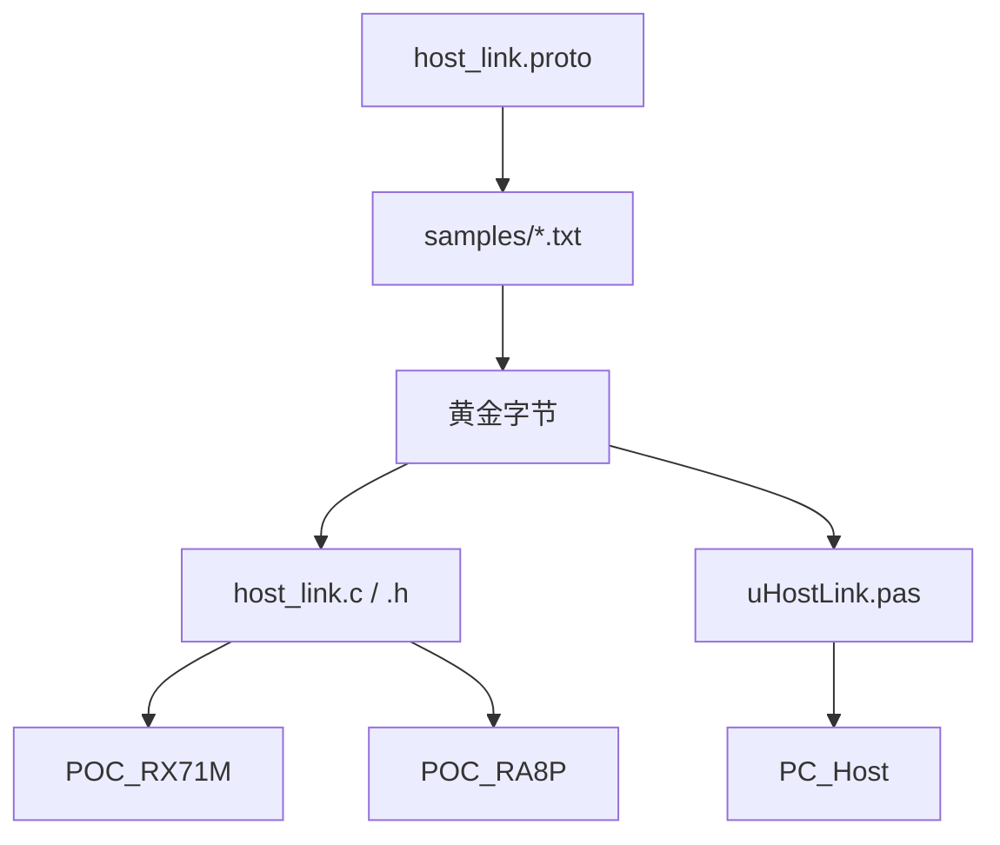

# 修改 HL1 协议的流程

改协议时只改一处依据，再手工把同一套规则写进两份编解码，最后用自检确认字节没有分叉。两块板不单独保存协议源文件。

协议正文见 `host_link_protocol.md`。本文只写修改时要动哪些文件、按什么顺序动。

## 1. 三份代码各干什么


| 文件                                            | 角色                     | 谁编译它                                                                            |
| --------------------------------------------- | ---------------------- | ------------------------------------------------------------------------------- |
| `protocol/host_link.proto`                    | 字段号、命令号、板卡号的文本依据       | 不进固件，也不进上位机。只给 protoc 36.2 算黄金字节                                                |
| `protocol/host_link.h`、`protocol/host_link.c` | 手写的 HL1 帧和 proto3 编解码  | RX71M、RA8P 在 `board_resources.cpp` 里 `#include "../../../protocol/host_link.c"` |
| `PC_Host/src/uHostLink.pas`                   | 同一套字节布局的第二份手写实现        | Lazarus 编译上位机。没有 `protoc --pascal_out`                                          |
| `protocol/selftest.c`                         | C 编解码与 protoc 黄金字节的对照  | `ci/pipeline.ps1 -Stage protocol`                                               |
| `protocol/samples/*.txt`                      | 给人读的文本样例，也是重新计算黄金字节的输入 | protoc `--encode` 的输入。编译固件时不读这些文件                                               |
| `PC_Host/tools/hl_check.lpr`                  | Pascal 与同一组黄金字节的对照     | `ci/pipeline.ps1 -Stage host`                                                   |


固件工程里没有协议的第二份拷贝。C 文件改完后，两块板下次编译都会带上。Pascal 不会跟着变。




## 2. 先决定改动落在哪一层


| 改动                     | 要动的实现                                                          |
| ---------------------- | -------------------------------------------------------------- |
| 增加命令、字段、板卡能力           | proto、C、Pascal、两边的自检数组都要改。固件回调按新字段增加                           |
| 只改 CRC、魔数、帧长这些 HL1 帧规则 | 不改 proto。改 `host_link.h`、`host_link.c` 和 `uHostLink.pas` 的组帧部分 |
| 只改某块板收到命令后怎么操作引脚       | 不改协议。只改对应工程的 `board_resources.cpp`                             |


字段号只追加，不复用已经出现过的号码。旧号码改含义后，已发出的板子和上位机会把旧数据解到新字段上。

取值为 0 仍有意义的控制量继续用 `optional`，这样 0 也会出现在线上。状态量保持 proto3 习惯，0 省略。CAN 数据仍限制为 1–8 字节。

## 3. 修改步骤

使用 protoc 36.2。不要用 MATLAB 或其他目录里更旧的 protoc，字节会和现有自检不一致。

### 3.1 改依据

编辑 `protocol/host_link.proto`。一个字段一行中文注释，写清单位和是否允许为 0。

若这条改动需要新的对照样本，就在 `protocol/samples/` 增加一个 `.txt`。文件内容是 protoc 文本格式，用 `#` 写中文说明。已有样本是：


| 文件                 | 覆盖的情况                      |
| ------------------ | -------------------------- |
| `ping.txt`         | 序号 1，PING                  |
| `set_outputs.txt`  | 掩码 0 也必须编码                 |
| `set_pwm.txt`      | 通道 0、占空比 0 也必须编码           |
| `send_can.txt`     | 通道 1、CAN FD、3 字节数据         |
| `send_classic.txt` | 通道 0、经典 CAN、`fd=false` 也编码 |
| `snapshot_ra.txt`  | RA8P 状态，含非零 ADC 和名字        |
| `ack_canfd.txt`    | 不支持 CAN FD 的 Ack           |


### 3.2 算出黄金字节

在 `protocol` 目录执行。下面以 PING 为例，其它样本换成对应的 txt 和消息名。消息名固定是 `renesas.hostlink.Envelope`。

```text
protoc --encode=renesas.hostlink.Envelope --proto_path=. host_link.proto < samples/ping.txt > samples/ping.bin
```

用十六进制查看 `ping.bin`，把字节写进 `protocol/selftest.c` 里同名用例的数组，并写进 `PC_Host/src/uHostLink.pas` 的 `HostLinkMatchesProtoc`。两边数组必须逐字节相同。

文本样本里的 `#` 注释不会进入编码结果。不要把注释写进没有 `#` 的行，否则 protoc 会把它当成字段。

### 3.3 改 C 编解码

按 proto 的字段号改 `protocol/host_link.h` 和 `protocol/host_link.c`。


| proto        | C 里要跟着改的位置                                                                                             |
| ------------ | ------------------------------------------------------------------------------------------------------ |
| 新枚举值         | `HL_CMD_*`、`HL_BOARD_*`、`HL_ACK_*`                                                                     |
| Envelope 新字段 | `HlEnvelope` 新成员，以及 `hl_encode_envelope`、`hl_decode_envelope`                                          |
| 嵌套消息的字段      | 对应的 `enc_*`、`dec_*`。通道、编号、fd 这类控制量用 force=1，0 也要写出                                                     |
| 只影响帧、不影响载荷   | `hl_encode_frame`、`hl_parser_push`、`hl_crc16`。Pascal 的 `HlEncodeFrame`、`THlParser.Push`、`Crc16` 做同样的改动 |


`hl_encode_envelope` 使用函数内静态缓冲，不能重入。板卡任务是单线程调用，不要改成嵌套调用。

### 3.4 改 Pascal

`uHostLink.pas` 里同名概念要和 C 对齐，不能只改一边。


| C                            | Pascal                                |
| ---------------------------- | ------------------------------------- |
| `HlEnvelope`                 | `THlEnvelope`                         |
| `pb_u32` / `pb_bool` 的 force | `TWr.U32` / `TWr.BoolField` 的 `Force` |
| `hl_encode_envelope`         | `HlEncodeEnvelope`                    |
| `hl_decode_envelope`         | `HlDecodeEnvelope`                    |
| `hl_encode_frame`            | `HlEncodeFrame`                       |
| `hl_parser_push`             | `THlParser.Push`                      |
| `hl_board_on_frame` 的命令分支    | 板卡侧仍在 C。上位机只编码请求、解码应答                 |


改完后看界面是否要新控件。纯协议能力可以先只改编解码，界面放到单独一次改动。界面改动在 `uMain.pas`，不要塞进 `uHostLink.pas`。

### 3.5 改板卡行为

协议多了一个命令时，在 `host_link.c` 的 `board_on_frame` 增加分支，并通过 `HlBoardOps` 回调到板子。

然后分别改：

- `POC_RX71M/src/board/board_resources.cpp`
- `POC_RA8P/src/board/board_resources.cpp`

两块板能力不同时，在回调里拒绝，并回已经约定的 Ack 字符串，例如 `can fd unsupported`。不要在 RX 上悄悄丢掉 CAN FD 还不回答。

### 3.6 自检

在仓库根目录执行：

```text
powershell -File ci\pipeline.ps1 -Stage protocol,host
```

`protocol` 用 Visual C++ 编译并运行 `selftest.c`。输出里每一行都是 `ok`，进程退出码为 0。

`host` 编译上位机，并运行 `hl_check.exe`。它应打印 `ok`。

这两段都通过之后，再编两套固件：

```text
powershell -File ci\pipeline.ps1 -Stage firmware
```

固件编译失败若来自回调签名不一致，回到 3.5。字节不对只可能来自 3.2 到 3.4，固件工程不会单独改载荷格式。

## 4. 改完核对

- proto 字段号没有复用。
- 值为 0 仍要发出的控制字段，C 和 Pascal 的 force 都为真。
- `selftest.c` 与 `uHostLink.pas` 的黄金字节逐字节相同，并来自 protoc 36.2。
- `samples` 里的新样本带有 `#` 中文注释，且 `--encode` 能读过。
- RX 与 RA 的差异写在回调和 Ack 里，没有分成两套帧格式。
- `host_link_protocol.md` 与 `host_link_protocol_ja.md` 按同一改动各写各的，不把两种语言写进同一个文件。


## 5. 现在不能自动生成的部分

protoc 不会重写 `host_link.c`，也没有维护中的 Pascal 后端。嵌入式工程不链接 libprotobuf。

因此第 3.3 步和第 3.4 步保持手工，用第 3.6 步的自检挡住写歪。不要用 `--c_out` 或第三方整库替换现有编解码，除非单独做一次生成器，并且生成结果仍通过现在的 `selftest.c` 和 `hl_check`。